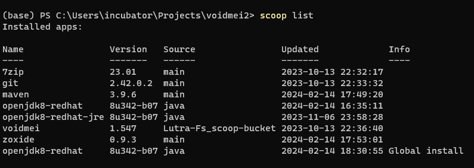

# VoidMei - 战争雷霆8111端口Java图形前端

# 工作原理
- 通过HTTP/GET请求读取127.0.01:8111端口中的飞行状态(state)以及飞行仪表(indicators)数据
- 解析离线拆包的气动模型文件(FM blkx)
- 处理/计算上述信息,以图形界面的形式呈现给用户

# 编译/构建

## 运行:
需要安装java8, maven, python3, 7zip, 无需下载额外的依赖.

java, maven和7zip可以通过scoop安装, 安装java需要加-g参数:



安装maven后更改本地repo存储路径, 以及换源:
`C:\Users\username\scoop\persist\maven\conf\settings.xml`
``` xml
  -->
  <localRepository>D:/maven/repository</localRepository>
  <!-- interactiveMode
  ......
     -->
    <mirror>
      <id>nexus-aliyun</id>
      <mirrorOf>central</mirrorOf>
      <name>Nexus aliyun</name>
      <url>http://maven.aliyun.com/nexus/content/groups/public</url>
    </mirror>
  </mirrors>
```

python3 最好安装3.8以后的版本.

### 运行自动构建脚本:
``` powershell
python ./build.py build

```

## clean:
!!! 会删除掉目录下所有的图片音效等资源文件, 请确认图片音效已经保存到resources.7z里 !!!

TODO: 检查文件夹和resources的mdate

``` powershell
python ./build.py clean

```

## 发布
需要下载[`launch4jc`](https://sourceforge.net/projects/launch4j/files/launch4j-3/3.50/), 并手动添加到`PATH` (TODO: 有没有其他的可以用scoop下载的打包软件)

然后运行:

``` powershell
python ./build.py publish
```

# 代码结构说明
由于编程过程比较随意,目前代码结构与变量命名比较混乱,后面有时间会调整
主要代码结构描述如下:
- src/prog/app.java - 程序入口
- src/prog/controller.java - 程序状态转换控制
- src/prog/service.java - HTTP数据请求与数据处理线程,
- src/prog/uiThread.java - UI绘制线程
- src/parser - state/indicator/blkx等解析器代码
- src/ui - 各ui界面的绘制代码
- src/ui/mainform.java - 主界面
- src/ui/minimalHUD.java - 最小HUD界面
- src/ui/flightInfo.java - 飞行状态信息界面
- src/ui/engineInfo.java - 引擎状态信息界面
- src/ui/stickValue.java - 飞行控制信息界面
- src/ui/engineControl.java - 发动机控制信息界面

# 执行环境
- 安装 Jave Runtime Environment 1.8(jre 1.8) 即可

## 网页右侧`release`处下载压缩包
然后选择`解压到voidmei文件夹`, 否则会解压出一堆小文件而非单独一个文件夹

## Windows命令行模式安装VoidMei
打开非管理员模式的终端[按下WIN+R-输入cmd-按下回车]，跳出终端窗口后输入以下命令

先安装scoop(如果已安装可跳过)
```
Set-ExecutionPolicy -ExecutionPolicy RemoteSigned -Scope CurrentUser
irm get.scoop.sh | iex
```

设置代理(如果网络无问题可以直接跳过)
```
scoop config proxy [ip:port]
```

安装git(如果已安装可跳过)
```
scoop install git
```

添加@Lustra-Fs大佬提供的bucket
```
scoop bucket add Lutra-Fs_scoop-bucket https://github.com/Lutra-Fs/scoop-bucket
```

安装Voidmei，安装完成后开始菜单中应该能看到VoidMei可执行文件
```
scoop install Lutra-Fs_scoop-bucket/voidmei
```

版本升级请用该命令
```
scoop update voidmei
```

## Linux执行环境配置 
VoidMei可使用Linux wine执行(测试环境Fedora 35, GNOME 41.7, Wine 7.10),执行步骤如下: 
- winecfg 兼容性设置为win10 
- 安装jre8, 执行wine jre-8uXXX-windows-x64.exe /s
- 运行VoidMei
