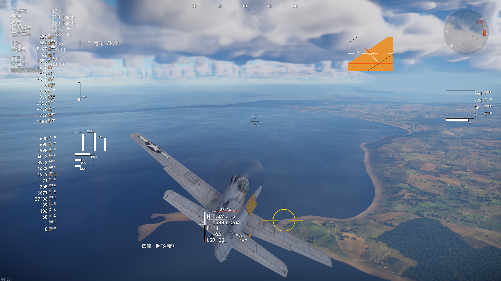

# VoidMei - 战争雷霆8111端口Java图形前端

[](https://github.com/matrixsukhoi/voidmei/actions/workflows/build.yml)
[](https://github.com/matrixsukhoi/voidmei/releases/latest)
[](LICENSE)

战争雷霆实时飞行数据 HUD。以半透明悬浮窗呈现飞行状态、引擎参数与语音告警, 并且能呈现fm拆包数据，帮助玩家快速掌握能量与机体状态。



## 工作原理

- 通过 HTTP GET 读取 `127.0.0.1:8111` 的飞行状态与飞行仪表数据
- 解析离线拆包的气动模型文件（FM blkx）
- 计算并渲染为可自由摆放的桌面悬浮窗

## 功能特性

比起[wtrti](https://github.com/MeSoftHorny/WTRTI)有诸多可视化与算法方面的优势；且 VoidMei 是完全开源（GPL-3.0）的自由软件。

这些优势源于基于 FM 拆包的一整套实时算法：

- **MiniHUD**：核心功能，高度可视化的紧凑型 UI，集成几乎所有空战有用信息
- **智能襟翼算法**：实时计算当前襟翼极限速度，精准到个位
- **智能速度算法**：综合可用速度实时显示，失速与锁舵同位提示，对高低空与可变后掠翼均有效
- **引擎耐热时**：计算引擎距过热损坏的具体时间，精准控温
- **增压器档位**：实时算出当前哪一档增压器功率最高，手操必备
- **动力量**：当前引擎状态与引擎理论极限状态的百分比
- **回转半径**：计算真正的飞行轨迹曲率半径
- **真实过载极限**：根据燃油量与逆向工程实时计算，不触发报警一定不会断
- **FM 拆包**：飞行中随时呼出飞行模型数据，支持飞机间对比
- **语音告警**：十余种条件触发，`voice/` 目录下的 wav 可自由替换
- **所见即所得**：所有开关与选项实时渲染预览，并附注释说明

各项指标的物理含义与 miniHUD 图示详见[使用说明](使用说明.txt)。

## 安装

### 方式一：GitHub Releases（推荐）

从 [Releases](https://github.com/matrixsukhoi/voidmei/releases/latest) 下载 zip 解压后运行 `VoidMei.exe`。需要 JRE 8（exe 已强制 Java 8，缺失时会提示下载地址）。

### 方式二：Scoop（Windows 命令行）

```powershell
# 安装 scoop (已装可跳过)
Set-ExecutionPolicy -ExecutionPolicy RemoteSigned -Scope CurrentUser
irm get.scoop.sh | iex

# 设置代理(如果网络无问题可以直接跳过)
scoop config proxy [ip:port]
# 安装git(如果已安装可跳过)
scoop install git

# 添加 bucket 并安装 (感谢 @Lutra-Fs 维护)
scoop bucket add Lutra-Fs_scoop-bucket https://github.com/Lutra-Fs/scoop-bucket
scoop install Lutra-Fs_scoop-bucket/voidmei

# 升级
scoop update voidmei
```

## 快速上手

1. 游戏请设为**全屏窗口（无边框）或窗口模式**运行。匹配模式即开即用；试飞与自定义模式需在难度选择中打开「允许使用网页界面」等开关
2. 运行 VoidMei，选择打开需要的面板并拖动至合适位置——所有开关与选项的影响实时渲染，所见即所得
3. 飞行中可随时点击任务栏的 VoidMei 图标，重启或修改配置
4. 建议先开启：MiniHUD；发动机面板 → 显示耐热时（动态计算引擎还能烧多少秒）

## 常见问题 (Q&A)

### OBS 无法捕捉 VoidMei 窗口?

VoidMei 基于 Java 的`逐像素透明窗口机制`实现,  OBS的"窗口"捕捉的两种采集方法——BitBlt 与 WGC 均无法获取这类窗口的内容.

### 提示 JVM NOT FOUND？

安装 JRE 8：<https://www.java.com/zh-CN/download/>，或使用 [Eclipse Temurin 8](https://adoptium.net/temurin/releases/?version=8)。

### 如何导入他人的配置？升级新版怎么保留配置？

务必使用「全局设置 → 导入配置」导入 `ui_layout.user.cfg`（程序目录下保存全部设置的文件），**切勿直接复制替换文件**——导入会先自动备份（`.bak`）并与当前版本模板合并，补齐新增选项；直接替换在版本不一致时会缺失新功能。升级新版：在原目录解压覆盖会自动保留并合并设置，换新目录则导入自己原先的 `ui_layout.user.cfg`（更新频率至少与 WarThunder 大版本同步）。从 v1.580 及更早版本升级：旧设置（`config/config.properties`）与新配置系统不兼容、无法迁移，需在设置界面重新调整或导入他人的 `ui_layout.user.cfg`。

### 游戏画面卡顿？

游戏以 **DX12 模式**运行时（Intel Arc 核显只允许 DX12，部分 A 卡同样），悬浮窗与游戏渲染冲突会导致画面卡顿，详见 [#54](https://github.com/matrixsukhoi/voidmei/issues/54)（同类工具也有此问题）。目前最有效的解法是**在游戏内锁帧（如 60fps），注意不要开垂直同步**；仍无改善时依次尝试：

1. 开关「全局设置」的「软件渲染模式」
2. 将游戏改为全屏窗口模式
3. 开关显卡驱动的「GPU 硬件加速计划」
4. 切换独显直连 / 混合模式

若只是 VoidMei 自身 CPU 占用偏高，增大"高级设置 → 数据帧延时（毫秒）"并启用"简化字体描边"即可。

### 支持 Linux 吗？

不支持原生linux运行。可在 Wine 下运行：`winecfg` 兼容性设为 win10，安装 Windows 版 JRE 8 后执行 `wine java -jar VoidMei.jar`。悬浮窗依赖的窗口透明与置顶特性在不同桌面环境下表现不一，请自行尝试。

## 从源码构建

环境要求：**JDK 1.8** 与 **Python 3.8+**（构建脚本仅用标准库）。依赖 jar 已在 `dep/` 中，无需额外安装。

```bash
git clone git@github.com:matrixsukhoi/voidmei.git
cd voidmei

python script/build.py fmdata   # 首次: 从本机游戏客户端解包生成 data/ (游戏目录自动探测),
                                #        或直接从 release 包复制 data/ 目录
python script/build.py run      # 编译并本地运行 (项目根即工作区)
python script/build.py test     # 单元测试 + e2e 回归
python script/build.py dist     # 组装完整分发包 → dist/VoidMei_v*.zip
```

其余子命令（`compile` / `jar` / `exe` / `clean` 等）见 `python script/build.py --help`。

## 项目结构

```
voidmei/
├── src/
│   ├── prog/      # 内核: 程序入口/生命周期/数据轮询线程/配置/事件总线/FM 加载
│   ├── parser/    # 数据解析: 8111 遥测 与 blkx 飞行模型
│   └── ui/        # 界面: 设置主界面 + 各悬浮窗 + 动态布局引擎
├── script/        # 统一构建入口 build.py + mock 服务器 + e2e 测试
├── test/          # 单元测试
├── data/          # FM 拆包数据 (派生, 不进 git, 由 fmdata 命令生成)
├── lang/          # 本地化资源
├── fonts/ voice/  # 字体与语音告警资源
├── ui_layout.cfg  # 界面布局 DSL 配置
└── dep/           # 第三方 jar (WebLaF, jnativehook)
```

## 文档

| 文档 | 内容 |
|------|------|
| [使用说明.txt](使用说明.txt) | 功能详解: 语音告警触发条件、FM 指标物理含义、miniHUD 图示 |
| [更新日志.txt](更新日志.txt) | 版本更新记录 |

## 贡献

欢迎 issue 与 PR。提交前请确保 `python script/build.py test` 全部通过。

## 支持与联系

- 问题与建议：[Issues](https://github.com/matrixsukhoi/voidmei/issues)
- 邮箱：<seclusionalagar@outlook.com>
- B 站：[隐居寒天](https://space.bilibili.com/14606916)

## 许可证

[GPL-3.0](LICENSE)
