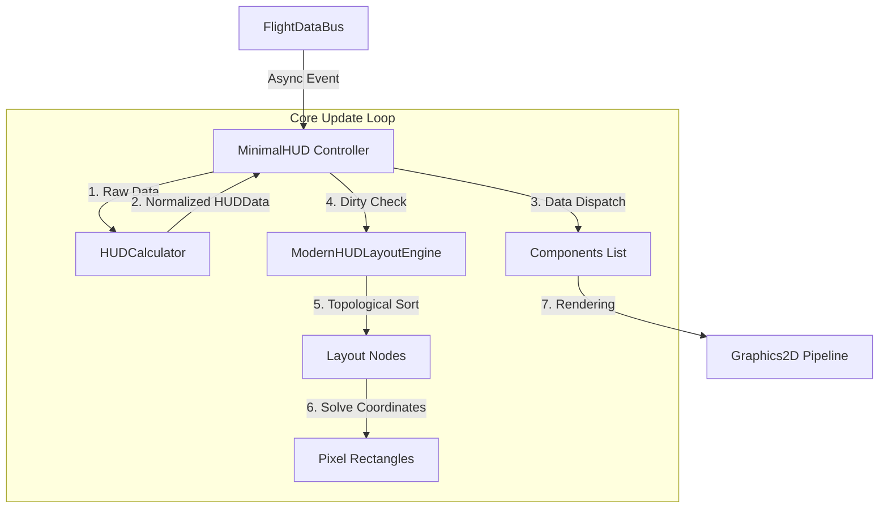
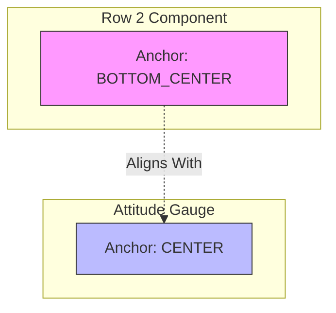

# MiniHUD 核心开发者手册 (The MiniHUD Core Developer Manual)

> **文档级别**: L3 (Core Contributor)
> **适用版本**: v1.5+
> **维护者**: Antigravity Agent
> **最后更新**: 2026-01-25

---

## 1. 架构总览 (Architectural Overview)

MiniHUD 是 VoidMei 项目中一个高追求的飞行数据平视显示器 (HUD) 模块。其设计目标是提供一个**高性能 (Zero-Allocation Rendering)**、**绝对稳定 (Jitter-Free)** 且 **完全响应式 (DPI-Independent)** 的现代化仪表盘。

为了实现上述目标，MiniHUD 摒弃了传统的绝对坐标布局，构建了一套专有的 **拓扑相对布局引擎 (Topological Relative Layout Engine)**。

### 1.1 系统数据流



---

## 2. 布局引擎内核 (Layout Engine Internals)

**源码**: `src/ui/layout/ModernHUDLayoutEngine.java`

MiniHUD 的布局引擎并非基于简单的 XY 列表，而是基于 **有向无环图 (DAG)** 的依赖解析器。

### 2.1 拓扑排序 (Topological Sorting)

在 `ModernHUDLayoutEngine.resolveTopology()` 中，引擎使用深度优先搜索 (DFS) 来解析组件间的依赖关系。

*   **根节点 (Roots)**: 没有父节点 (`parent == null`) 的组件。
*   **依赖链**: 如果 B 依赖 A (B.parent = A)，则 A 被视为 B 的前置依赖。
*   **排序保证**: 算法保证父组件永远比子组件先计算坐标。

```java
// 伪代码逻辑
foreach (node in nodes):
    if (node.parent == null) visit(node)

void visit(node):
    if (visiting.contains(node)) throw CycleException // 循环依赖检测
    layoutOrder.add(node)
    foreach (child in node.children):
        visit(child)
```

> **开发者注意**: 在构建 UI 时，切勿创建 A -> B -> A 的循环依赖，否则引擎会记录错误并中断布局。

### 2.2 脏标记机制 (Dirty Flag Mechanism)

为了极致性能，布局计算是 **惰性 (Lazy)** 的。只有当以下情况发生时，`dirty` 标志才会被置位：:
1.  Canvas 尺寸改变 (`setCanvasSize`)
2.  行高/字体大小改变 (`setLineHeight`)
3.  添加/移除节点
4.  手动调用 `setDebug`

在 `render()` 循环中，引擎首先检查 `dirty`，只有在脏状态下才执行昂贵的 `resolveTopology` 和 `calculateCoordinates`。

---

## 3. 锚点与坐标系统 (Anchors & Coordinates)

**源码**: `src/ui/layout/HUDLayoutNode.java`, `src/ui/layout/Anchor.java`

这是 MiniHUD 最核心的概念。如果不理解本节，你将无法正确放置任何组件。

### 3.1 相对单位坐标 (Unit Coordinates)

MiniHUD 不使用像素 (px) 作为定位单位，而是使用 **"行高单位 (Unit)"**。
*   **1 Unit** = 当前 `ctx.hudFontSize` (例如 16px 或 32px)。
*   **优势**: 当用户在设置中调整字体大小时，所有组件的间距会自动按比例缩放，无需任何额外代码。

### 3.2 锚点对齐逻辑 (Anchor Alignment Logic)

组件的位置由公式 `solve()` 决定：
> **Self.Point(SelfAnchor) = Parent.Point(ParentAnchor) + Offset(Unit * LineHeight)**

这意味着我们在定义位置时，实际上是在定义 **"我的哪个点"** 对齐到 **"父亲的哪个点"**。

#### 代码实例解析
让我们回顾 `MinimalHUD.java` (L624-L636) 中的经典案例：

```java
// 姿态仪 (Attitude) 挂载
ui.layout.HUDLayoutNode attitudeNode = new ui.layout.HUDLayoutNode("attitude", attitudeIndicatorGauge);
attitudeNode.setParent(row2)
        // 1. 偏移: X无偏移, Y向下偏移 0.1行高 (微调间距)
        .setRelativePosition(0, 0.1) 
        // 2. 锚点: 我的中心 (CENTER) 对齐到 父节点的底部中心 (BOTTOM_CENTER)
        .setAnchors(ui.layout.Anchor.BOTTOM_CENTER, ui.layout.Anchor.CENTER);
modernLayout.addNode(attitudeNode);
```

**图解**:


这种挂载方式保证了：无论 `Row 2` 的宽度如何变化（即使它变得很宽），姿态仪始终保持在 `Row 2` 的**水平中心线**上。

而对于罗盘 (Compass):
```java
compassNode.setParent(row2)
        .setRelativePosition(0, 0.1)
        .setAnchors(ui.layout.Anchor.BOTTOM_RIGHT, ui.layout.Anchor.TOP_RIGHT);
```
这里使用了 **右对齐**: 罗盘的右上角 (`TOP_RIGHT`) 对齐到 Row 2 的右下角 (`BOTTOM_RIGHT`)。
这导致罗盘会紧贴 Row 2 的右边缘。

---

## 4. 节点拓扑管理 (Node Topology)

**开发者必读**: 正确构建父子链是 UI 稳定的关键。

### 4.1 推荐拓扑结构
建议使用 **"脊柱-挂件" (Spine-Attachment)** 模式：
1.  **脊柱**: 左侧的文本行 (`Row 0` -> `Row 1` -> `Row 2`...) 构成主脊柱。它们首尾相连，负责撑起整个 HUD 的高度。
2.  **挂件**: 图形仪表 (`Attitude`, `Compass`, `FlapBar`) 作为叶子节点挂载在特定的 Row 上。

### 4.2 Z-Order 与渲染顺序
`ModernHUDLayoutEngine` 按照拓扑排序的顺序进行渲染。
*   父节点先渲染，子节点后渲染。
*   这意味着 **子节点永远覆盖在父节点之上**。
*   如果需要调整遮挡关系，请调整父子层级。

---

## 5. 组件生命周期与内存安全 (Lifecycle & Memory)

**典型事故**: "Zombie Listener" (僵尸监听器)。

### 5.1 问题背景
`MinimalHUD` 是一个瞬态对象 (Transient Object)，当用户开关 HUD 或切换模式时会被销毁重建。
但是 `FlightDataBus` 和 `EventBus` 是全局单例 (Singleton)。

### 5.2 黄金法则
1.  **禁止在 Component 中注册全局监听**: `HUDComponent` 不应直接 `EventBus.register(this)`。
2.  **统一分发**: 所有事件应由 `MinimalHUD` (Controller) 接收，并通过 `component.onDataUpdate(data)` 或者 `layoutEngine.setDebug(bool)` 手动传递下去。
3.  **销毁清理**: 必须在 `dispose()` 方法中显式注销所有订阅。

```java
// 正确做法 (MinimalHUD.java)
@Override
public void dispose() {
    unsubscribeFromEvents(); // 必须调用!
    super.dispose();
}
```

---

## 6. 布局稳定性方案 (Layout Stability)

MiniHUD 最引以为傲的特性是**"零抖动" (Zero-Jitter)**。

### 6.1 模板宽度机制 (Template Width Strategy)
在 GUI 开发中，可变宽度的组件是布局动荡的根源。
例如：高度数据从 `99` (2位数) 变为 `100` (3位数)，会导致 `Row 2` 变宽。
如果姿态仪挂载在 `Row 2` 的中心，`Row 2` 变宽会导致姿态仪向右平移。这种每秒 60 次的平移会在视觉上形成剧烈的抖动。

**解决方案**:
所有 `HUDTextRow` 必须设置 **宽度模板 (Template)**。

```java
// 错误: 宽度随内容变化
row.setText("ALT " + currentAlt); 

// 正确: 宽度被锁定为 "ALT 88888" 的物理宽度
row.setTemplate("ALT 88888"); 
row.setText("ALT " + currentAlt);
```

布局引擎在计算坐标时，会优先读取 Template 的宽度。这样无论实际数值是多少，组件占据的物理空间永远恒定。

---

## 7. 响应式组件开发 (Responsive Components)

### 7.1 线性缩放数学模型
为了支持 4K 屏和低分屏，任何图形绘制都不能使用硬编码像素 (Magic Number)。

**错误示范**:
```java
g.fillRect(x, y, 200, 10); // 200px 在 4K 屏上像一根牙签
```

**正确示范**:
```java
// 使用行高作为基准单位
int width = (int) (ctx.hudFontSize * 8.5); // 约等于 8.5 个字符宽
int height = (int) (ctx.hudFontSize * 0.5); // 半行高
g.fillRect(x, y, width, height);
```

---

## 8. 配置与持久化 (Configuration)

MiniHUD 的布局配置存储在 `ui_layout.cfg` 中。
虽然目前主要通过代码硬编码拓扑结构，但 `MinimalHUD` 的设计为将来支持 XML/JSON 定义布局留出了接口。
目前支持的配置项：
*   `hudFontSize`: 全局缩放基准
*   `enableLayoutDebug`: 开启调试线框

---

## 9. 调试与排错 (Debugging)

### 9.1 可视化调试系统
在 `ui_layout.cfg` 中设置 `enableLayoutDebug = true`。

*   **边框**:
    组件自己认为自己有多大 (`getPreferredSize`)。
    *故障排查*: 如果红框随着数值跳变而忽大忽小，说明**模板未设置正确**。


---

## 10. 贡献者准则 (Contributor Guidelines)

1.  **单一职责**: `HUDComponent` 只负责画，`HUDLayoutNode` 只负责算。不要在 Component 里写位置计算代码。
2.  **无状态绘制**: `draw()` 方法必须是无副作用的 (Stateless)。不要在 draw 里面修改成员变量。
3.  **防御性编程**: 在 `solve()` 和 `draw()` 中始终检查 `null`，尤其是 `font` 和 `ctx` 对象，因为它们可能是异步加载的。
4.  **性能优先**: 严禁在 `draw()` 循环中 `new` 对象 (如 `new Color`, `new Font`)。必须使用缓存的静态常量或成员变量。
5.  **文档注释**: 修改核心算法 (`ModernHUDLayoutEngine`) 必须更新本文档。

---
*MiniHUD Development Team*
