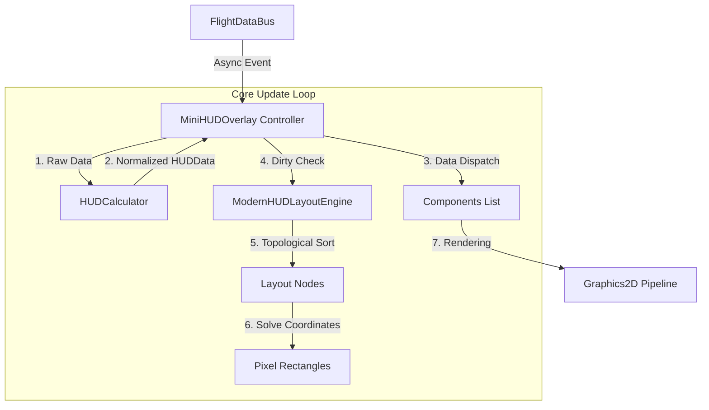
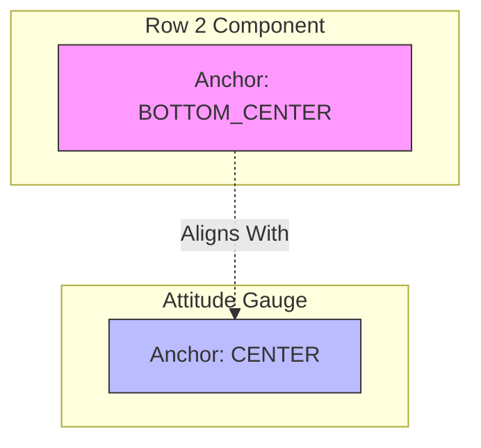

# MiniHUD 核心开发者手册 (The MiniHUD Core Developer Manual)

> **文档级别**: L3 (Core Contributor)
> **适用版本**: v1.5+
> **维护者**: Antigravity Agent
> **最后更新**: 2026-02

---

## 1. 架构总览 (Architectural Overview)

MiniHUD 是 VoidMei 项目中一个高追求的飞行数据平视显示器 (HUD) 模块。其设计目标是提供一个**高性能 (Zero-Allocation Rendering)**、**绝对稳定 (Jitter-Free)** 且 **完全响应式 (DPI-Independent)** 的现代化仪表盘。

为了实现上述目标，MiniHUD 摒弃了传统的绝对坐标布局，构建了一套专有的 **拓扑相对布局引擎 (Topological Relative Layout Engine)**。

### 1.1 系统数据流


```mermaid
graph TD
    Bus[FlightDataBus] -->|Async Event| Ctrl[MiniHUDOverlay Controller]

    subgraph Core Loop [Core Update Loop]
        direction TB
        Ctrl -->|1. Raw Data| Calc[HUDCalculator]
        Calc -->|2. Normalized HUDData| Ctrl
        Ctrl -->|3. Data Dispatch| Comp[Components List]

        Ctrl -->|4. Dirty Check| Layout[ModernHUDLayoutEngine]
        Layout -->|5. Topological Sort| Nodes[Layout Nodes]
        Nodes -->|6. Solve Coordinates| Rects[Pixel Rectangles]
    end

    Comp -->|7. Rendering| G2D[Graphics2D Pipeline]
```

### 1.2 数据流架构深度分析 (Data Flow Architecture Deep Dive)

本节从系统设计的角度，剖析 MiniHUD 完整的数据流路径，评估各层抽象的必要性，帮助开发者理解每个设计决策背后的权衡。

#### 1.2.1 完整数据流路径

```
┌─────────────────────────────────────────────────────────────────────────────┐
│                         WAR THUNDER DATA PIPELINE                           │
├─────────────────────────────────────────────────────────────────────────────┤
│                                                                             │
│   ┌──────────────────┐                                                      │
│   │ War Thunder API  │  HTTP GET http://127.0.0.1:8111/                     │
│   │  (Port 8111)     │  ├── /state     → 飞行状态 (位置、速度、姿态)         │
│   │                  │  └── /indicators → 仪表数据 (引擎、燃油、武器)        │
│   └────────┬─────────┘                                                      │
│            │ ~20Hz polling (默认50ms，可配置)                               │
│            ▼                                                                │
│   ┌──────────────────┐                                                      │
│   │   Service.java   │  Background Thread (非 EDT)                          │
│   │                  │  ├── HTTP 轮询 + JSON 解析                            │
│   │                  │  ├── State.java / Indicators.java 映射               │
│   │                  │  ├── HUDData 预计算 (在 Service 线程)                 │
│   │                  │  └── 派生指标计算 (FlightAnalyzer)                    │
│   └────────┬─────────┘                                                      │
│            │ publish()                                                      │
│            ▼                                                                │
│   ┌──────────────────┐                                                      │
│   │  FlightDataBus   │  Event Publisher (观察者模式)                        │
│   │                  │  └── 广播 FlightDataEvent 给所有订阅者                │
│   │                  │      (event 携带预计算的 HUDData)                     │
│   └────────┬─────────┘                                                      │
│            │ FlightDataEvent (包含 EventPayload + HUDData)                  │
│            ▼                                                                │
├─────────────────────────────────────────────────────────────────────────────┤
│                         MINIHUD PROCESSING PIPELINE                         │
├─────────────────────────────────────────────────────────────────────────────┤
│            │                                                                │
│            ▼                                                                │
│   ┌──────────────────┐                                                      │
│   │ MiniHUDOverlay   │  FlightDataListener.onFlightData()                   │
│   │  (Controller)    │  ├── 接收事件（在 Service 线程）                      │
│   │                  │  └── SwingUtilities.invokeLater() → EDT              │
│   └────────┬─────────┘                                                      │
│            │ HUDData (已预计算，不可变)                                      │
│            ▼                                                                │
│   ┌──────────────────┐                                                      │
│   │     HUDData      │  Immutable Frame Snapshot                            │
│   │                  │  └── 包含本帧所有显示所需的计算结果                   │
│   └────────┬─────────┘                                                      │
│            │ component.onDataUpdate(hudData)                                │
│            ▼                                                                │
│   ┌──────────────────┐                                                      │
│   │  HUDComponent[]  │  Visual Components (Stateless Draw)                  │
│   │                  │  ├── HUDTextRow, AttitudeIndicatorGauge, ...         │
│   │                  │  ├── 缓存 lastValue 做 Dirty Check                   │
│   │                  │  └── draw(Graphics2D, Rectangle) → 渲染              │
│   └────────┬─────────┘                                                      │
│            │                                                                │
│            ▼                                                                │
│   ┌──────────────────┐                                                      │
│   │   Graphics2D     │  Java2D Rendering Pipeline                           │
│   │                  │  └── 最终像素输出到屏幕                               │
│   └──────────────────┘                                                      │
│                                                                             │
└─────────────────────────────────────────────────────────────────────────────┘
```

#### 1.2.2 各层必要性评估

| 层级 | 职责 | 必要性 | 理由 |
|------|------|--------|------|
| **FlightDataBus** | 发布-订阅解耦 | ✅ 必要 | 将数据生产者 (Service) 与消费者 (Overlays) 解耦；支持多个 Overlay 独立订阅；允许动态注册/注销监听器 |
| **FlightDataEvent** | 事件封装 | ✅ 必要 | 携带 EventPayload 和预计算的 HUDData；提供类型安全的事件传递；未来可扩展事件元数据 (时间戳、序列号) |
| **EventPayload** | 低频逻辑标志 | ✅ 必要 | 不可变对象保证线程安全；类型安全的布尔/枚举字段；避免 Service 线程和 EDT 之间的数据竞争 |
| **HUDData** | 帧数据快照 | ✅ 必要 | 预计算避免 EDT 阻塞；不可变对象确保一帧内数据一致性；组件间共享计算结果避免重复计算 |
| **TelemetrySource** | 零 GC 数值访问 | ✅ 必要 | 高频数值访问避免 Double 装箱；保持 EventPayload 的 Boolean 类型简洁 |
| **HUDComponent** | 组件化渲染 | ✅ 合理 | 单一职责；可复用；独立测试；支持动态组合 |
| **ModernHUDLayoutEngine** | DAG 布局 | ✅ 合理 | 支持相对锚点定位；惰性计算减少开销；DPI 无关的单位系统 |

#### 1.2.3 数据访问模式

MiniHUD 采用**双通道数据访问模式**，针对不同数据类型优化：

```java
// 模式 1: HUDData — 预计算的显示数据
// 由 HUDCalculator 在 Service 线程计算，避免 EDT 阻塞
@Override
public void onFlightData(FlightDataEvent event) {
    HUDData data = event.getHudData();  // 预计算结果
    if (data == null) return;
    SwingUtilities.invokeLater(() -> updateComponents(data));
}

// 模式 2: TelemetrySource — 高频数值数据
// 用于需要实时访问原始数据的场景
private ui.model.TelemetrySource telemetrySource;

public void init(Service s, OverlaySettings settings) {
    // 正确方式：从 Service 转型获取
    if (s instanceof ui.model.TelemetrySource) {
        this.telemetrySource = (ui.model.TelemetrySource) s;
    }
}

// 使用示例
@Override
public void onFlightData(FlightDataEvent event) {
    // 低频数据: 从 EventPayload 读取
    EventPayload payload = event.getPayload();
    boolean isJet = payload.isJet;

    // 高频数据: 通过 TelemetrySource 零装箱访问
    if (telemetrySource != null) {
        double ias = telemetrySource.getIAS();
        double alt = telemetrySource.getAltitude();
    }
}
```

**⚠️ 重要**：`TelemetrySource` **不是**通过 `EventPayload` 获取的！正确的获取方式是从 `Service` 转型：

```java
// ❌ 错误：TelemetrySource 不在 EventPayload 中
TelemetrySource telem = payload.getTelemetrySource();  // 编译错误！

// ✅ 正确：从 Service 转型获取
if (service instanceof ui.model.TelemetrySource) {
    this.telemetrySource = (ui.model.TelemetrySource) service;
}
```

**为什么需要两种模式？**

| 数据类型 | 访问频率 | 装箱开销 | 推荐模式 |
|----------|----------|----------|----------|
| 布尔标志 (gear, airborne) | 每帧 1 次 | 无 (primitive) | EventPayload 字段 |
| 预计算显示数据 | 每帧 1 次 | 无 (在 Service 线程计算) | HUDData |
| 数值数据 (IAS, altitude) | 每帧 10+ 次 | 高 (如用 Map<String, Double>) | TelemetrySource 接口 |

#### 1.2.4 HUDData 预计算模式

MiniHUD 的核心性能优化是 **HUDData 预计算**。`HUDCalculator` 在 Service 线程计算所有显示数据，避免在 EDT 上执行耗时计算。

```java
// Service.java - 在后台线程预计算
HUDData hudData = HUDCalculator.calculate(event, this, blkx, hudSettings, null);
event.setHudData(hudData);
FlightDataBus.getInstance().publish(event);

// MiniHUDOverlay.java - 直接消费预计算数据
@Override
public void onFlightData(FlightDataEvent event) {
    HUDData data = event.getHudData();  // 已在 Service 线程计算完成！
    if (data == null) return;
    SwingUtilities.invokeLater(() -> updateComponents(data));
}
```

**性能收益**:

| 指标 | 无预计算 | 有预计算 |
|------|----------|----------|
| EDT 阻塞时间 | 40-60ms | <5ms |
| 帧率稳定性 | 可能卡顿 | 稳定 |
| GC 压力 | 每帧计算分配 | 一次性分配 |

#### 1.2.5 线程模型

```
┌─────────────────────────────────────────────────────────────────┐
│                        THREAD MODEL                             │
├─────────────────────────────────────────────────────────────────┤
│                                                                 │
│  ┌─────────────────┐         ┌─────────────────┐               │
│  │  Service Thread │         │   EDT (Swing)   │               │
│  │  (Background)   │         │  Event Dispatch │               │
│  ├─────────────────┤         ├─────────────────┤               │
│  │ • HTTP polling  │         │ • UI rendering  │               │
│  │ • JSON parsing  │         │ • Event handling│               │
│  │ • HUDData calc  │◄─────── │ • Component     │               │
│  │                 │         │   updates       │               │
│  └────────┬────────┘         └────────▲────────┘               │
│           │                           │                         │
│           │  FlightDataEvent          │                         │
│           │  (immutable, 含 HUDData)  │                         │
│           ▼                           │                         │
│  ┌─────────────────────────────────────────────┐               │
│  │              FlightDataBus                   │               │
│  │                                              │               │
│  │  listener.onFlightData(event) {             │               │
│  │      // 在 Service 线程执行！                 │               │
│  │      SwingUtilities.invokeLater(() -> {     │◄─── 关键！     │
│  │          // 确保在 EDT 执行                  │               │
│  │          processData(event.getHudData());   │               │
│  │      });                                     │               │
│  │  }                                           │               │
│  └─────────────────────────────────────────────┘               │
│                                                                 │
└─────────────────────────────────────────────────────────────────┘
```

**为什么必须用 `SwingUtilities.invokeLater()`？**

1. **Swing 线程安全规则**: 所有 Swing 组件的访问必须在 EDT 上进行
2. **竞态条件**: Service 线程和 EDT 同时访问组件状态会导致数据撕裂
3. **重绘合并**: `invokeLater` 允许多个更新请求合并，减少重绘次数

```java
// ❌ 错误: 直接在 Service 线程更新 UI
@Override
public void onFlightData(FlightDataEvent event) {
    altitudeLabel.setText(String.valueOf(data.altitude)); // 线程不安全！
}

// ✅ 正确: 调度到 EDT
@Override
public void onFlightData(FlightDataEvent event) {
    HUDData data = event.getHudData();
    if (data == null) return;
    SwingUtilities.invokeLater(() -> {
        processDataOnEDT(data);
    });
}
```

---

## 2. 布局引擎内核 (Layout Engine Internals)

**源码**: `src/ui/layout/ModernHUDLayoutEngine.java`

MiniHUD 的布局引擎并非基于简单的 XY 列表，而是基于 **有向无环图 (DAG)** 的依赖解析器。

### 2.1 拓扑排序 (Topological Sorting)

在 `ModernHUDLayoutEngine.resolveTopology()` 中，引擎使用深度优先搜索 (DFS) 来解析组件间的依赖关系。

*   **根节点 (Roots)**: 没有父节点 (`parent == null`) 的组件。
*   **依赖链**: 如果 B 依赖 A (B.parent = A)，则 A 被视为 B 的前置依赖。
*   **排序保证**: 算法保证父组件永远比子组件先计算坐标。

```java
// 伪代码逻辑
foreach (node in nodes):
    if (node.parent == null) visit(node)

void visit(node):
    if (visiting.contains(node)) throw CycleException // 循环依赖检测
    layoutOrder.add(node)
    foreach (child in node.children):
        visit(child)
```

> **开发者注意**: 在构建 UI 时，切勿创建 A -> B -> A 的循环依赖，否则引擎会记录错误并中断布局。

### 2.2 脏标记机制 (Dirty Flag Mechanism)

为了极致性能，布局计算是 **惰性 (Lazy)** 的。只有当以下情况发生时，`dirty` 标志才会被置位：
1.  Canvas 尺寸改变 (`setCanvasSize`)
2.  行高/字体大小改变 (`setLineHeight`)
3.  添加/移除节点
4.  手动调用 `setDebug`

在 `render()` 循环中，引擎首先检查 `dirty`，只有在脏状态下才执行昂贵的 `resolveTopology` 和 `calculateCoordinates`。

---

## 3. 锚点与坐标系统 (Anchors & Coordinates)

**源码**: `src/ui/layout/HUDLayoutNode.java`, `src/ui/layout/Anchor.java`

这是 MiniHUD 最核心的概念。如果不理解本节，你将无法正确放置任何组件。

### 3.1 相对单位坐标 (Unit Coordinates)

MiniHUD 不使用像素 (px) 作为定位单位，而是使用 **"行高单位 (Unit)"**。
*   **1 Unit** = 当前 `ctx.hudFontSize` (例如 16px 或 32px)。
*   **优势**: 当用户在设置中调整字体大小时，所有组件的间距会自动按比例缩放，无需任何额外代码。

### 3.2 锚点对齐逻辑 (Anchor Alignment Logic)

组件的位置由公式 `solve()` 决定：
> **Self.Point(SelfAnchor) = Parent.Point(ParentAnchor) + Offset(Unit * LineHeight)**

这意味着我们在定义位置时，实际上是在定义 **"我的哪个点"** 对齐到 **"父亲的哪个点"**。

#### 代码实例解析
让我们回顾 `MiniHUDOverlay.java` 中的经典案例：

```java
// 姿态仪 (Attitude) 挂载
ui.layout.HUDLayoutNode attitudeNode = new ui.layout.HUDLayoutNode("attitude", attitudeIndicatorGauge);
attitudeNode.setParent(row2)
        // 1. 偏移: X无偏移, Y向下偏移 0.1行高 (微调间距)
        .setRelativePosition(0, 0.1)
        // 2. 锚点: 我的中心 (CENTER) 对齐到 父节点的底部中心 (BOTTOM_CENTER)
        .setAnchors(ui.layout.Anchor.BOTTOM_CENTER, ui.layout.Anchor.CENTER);
modernLayout.addNode(attitudeNode);
```

**图解**:

```mermaid
graph TD
    subgraph Row2 [Row 2 Component]
         BC[Anchor: BOTTOM_CENTER]
    end

    subgraph Attitude [Attitude Gauge]
        C[Anchor: CENTER]
    end

    BC -.->|Aligns With| C
    style BC fill:#f9f,stroke:#333
    style C fill:#bbf,stroke:#333
```

这种挂载方式保证了：无论 `Row 2` 的宽度如何变化（即使它变得很宽），姿态仪始终保持在 `Row 2` 的**水平中心线**上。

> **姿态仪双值显示**: 姿态仪 (`AttitudeIndicatorGauge`) 显示两个数值：
> - **左侧**: 侧滑角 (Slip)，保留 1 位小数
> - **右侧**: 俯仰角 (Pitch)，整数显示
>
> 当俯仰数据无效时 (`pitchValid = false`)，右侧俯仰角文字会隐藏。颜色根据正负值变化。

而对于罗盘 (Compass):
```java
compassNode.setParent(row2)
        .setRelativePosition(0, 0.1)
        .setAnchors(ui.layout.Anchor.BOTTOM_RIGHT, ui.layout.Anchor.TOP_RIGHT);
```
这里使用了 **右对齐**: 罗盘的右上角 (`TOP_RIGHT`) 对齐到 Row 2 的右下角 (`BOTTOM_RIGHT`)。
这导致罗盘会紧贴 Row 2 的右边缘。

---

## 4. 节点拓扑管理 (Node Topology)

**开发者必读**: 正确构建父子链是 UI 稳定的关键。

### 4.1 推荐拓扑结构
建议使用 **"脊柱-挂件" (Spine-Attachment)** 模式：
1.  **脊柱**: 左侧的文本行 (`Row 0` -> `Row 1` -> `Row 2`...) 构成主脊柱。它们首尾相连，负责撑起整个 HUD 的高度。
2.  **挂件**: 图形仪表 (`Attitude`, `Compass`, `FlapBar`) 作为叶子节点挂载在特定的 Row 上。

### 4.2 Z-Order 与渲染顺序
`ModernHUDLayoutEngine` 按照拓扑排序的顺序进行渲染。
*   父节点先渲染，子节点后渲染。
*   这意味着 **子节点永远覆盖在父节点之上**。
*   如果需要调整遮挡关系，请调整父子层级。

---

## 5. 组件生命周期与内存安全 (Lifecycle & Memory)

**典型事故**: "Zombie Listener" (僵尸监听器)。

### 5.1 问题背景
`MiniHUDOverlay` 是一个瞬态对象 (Transient Object)，当用户开关 HUD 或切换模式时会被销毁重建。
但是 `FlightDataBus` 和 `EventBus` 是全局单例 (Singleton)。

### 5.2 黄金法则
1.  **禁止在 Component 中注册全局监听**: `HUDComponent` 不应直接 `EventBus.register(this)`。
2.  **统一分发**: 所有事件应由 `MiniHUDOverlay` (Controller) 接收，并通过 `component.onDataUpdate(data)` 或者 `layoutEngine.setDebug(bool)` 手动传递下去。
3.  **销毁清理**: 必须在 `dispose()` 方法中显式注销所有订阅。

```java
// 正确做法 (MiniHUDOverlay.java)
@Override
public void dispose() {
    FlightDataBus.getInstance().unregister(this); // 必须调用!
    super.dispose();
}
```

---

## 6. 布局稳定性方案 (Layout Stability)

MiniHUD 最引以为傲的特性是**"零抖动" (Zero-Jitter)**。

### 6.1 模板宽度机制 (Template Width Strategy)
在 GUI 开发中，可变宽度的组件是布局动荡的根源。
例如：高度数据从 `99` (2位数) 变为 `100` (3位数)，会导致 `Row 2` 变宽。
如果姿态仪挂载在 `Row 2` 的中心，`Row 2` 变宽会导致姿态仪向右平移。这种每秒 60 次的平移会在视觉上形成剧烈的抖动。

**解决方案**:
所有 `HUDTextRow` 必须设置 **宽度模板 (Template)**。

```java
// 错误: 宽度随内容变化
row.setText("ALT " + currentAlt);

// 正确: 宽度被锁定为 "ALT 88888" 的物理宽度
row.setTemplate("ALT 88888");
row.setText("ALT " + currentAlt);
```

布局引擎在计算坐标时，会优先读取 Template 的宽度。这样无论实际数值是多少，组件占据的物理空间永远恒定。

---

## 7. 响应式组件开发 (Responsive Components)

### 7.1 线性缩放数学模型
为了支持 4K 屏和低分屏，任何图形绘制都不能使用硬编码像素 (Magic Number)。

**错误示范**:
```java
g.fillRect(x, y, 200, 10); // 200px 在 4K 屏上像一根牙签
```

**正确示范**:
```java
// 使用行高作为基准单位
int width = (int) (ctx.hudFontSize * 8.5); // 约等于 8.5 个字符宽
int height = (int) (ctx.hudFontSize * 0.5); // 半行高
g.fillRect(x, y, width, height);
```

---

## 8. 绘图工具库 (Graphics Utilities)

**源码**: `src/ui/util/GraphicsUtil.java`

MiniHUD 提供了一套绘图工具库，用于解决 Java2D 绘制中的常见陷阱。

### 8.1 精确端点绘制 (Precise Endpoint Rendering)

**问题背景**:
Java2D 的 `BasicStroke` 默认使用 `CAP_SQUARE` 线帽，这会导致线条在端点处**自动延伸** stroke 宽度的一半。

```
        期望的渲染范围
        |<---- width ---->|
        x                 x+width

实际渲染: █████████████████████
        |                     |
       x-1                  x+width+1  (假设 stroke = 2px)
```

**典型事故**: 在 `SpeedRatioBar` 中绘制 Unit Mach 红线时，使用 `g2d.drawLine(x, y, x + width, y)` 本意是让线条精确对齐 vbar 边界，但由于 `CAP_SQUARE` 导致红线右边缘超出 vbar 1-2 像素。

**解决方案**: 使用 `GraphicsUtil.createPreciseStroke()` 创建精确端点的 Stroke。

```java
// 错误: 默认 CAP_SQUARE 会导致端点延伸
Stroke bad = new BasicStroke(2);

// 正确: 使用 CAP_BUTT 确保精确端点
Stroke good = GraphicsUtil.createPreciseStroke(2);
```

### 8.2 可用方法

| 方法 | 用途 |
|------|------|
| `createPreciseStroke(width)` | 精确端点，适合边界对齐线条 |
| `createPreciseStroke(width, join)` | 精确端点 + 自定义拐角样式 |
| `createRoundedStroke(width)` | 圆角端点，适合装饰性线条 |
| `configureOverlayRendering(g2d)` | 配置标准渲染提示 (抗锯齿等) |

---

## 9. 配置与持久化 (Configuration)

MiniHUD 的布局配置存储在 `ui_layout.cfg` 中。
虽然目前主要通过代码硬编码拓扑结构，但 `MiniHUDOverlay` 的设计为将来支持 XML/JSON 定义布局留出了接口。
目前支持的配置项：
*   `hudFontSize`: 全局缩放基准
*   `enableLayoutDebug`: 开启调试线框
*   `showSpeedBar`: 速度条/油门条切换开关

### 9.1 速度条/油门条切换 (SpeedBar/ThrottleBar Toggle)

MiniHUD 左侧支持两种条形仪表，用户可通过 `showSpeedBar` 配置项切换：

| 配置值 | 显示组件 | 说明 |
|--------|----------|------|
| `true` (默认) | `SpeedRatioBar` | 显示当前速度与极限速度的比值 |
| `false` | `ThrottleBar` | 显示油门杆位置 (0-110%) |

**实现要点**:
1.  两个 Bar 共享相同的布局位置 (`row4` 左侧，锚点 `BOTTOM_LEFT -> BOTTOM_RIGHT`)
2.  `ThrottleBar` 使用 `tickOnRight=false` 使刻度显示在左侧
3.  可见性控制在 `updateComponents()` 中基于 `hudSettings.showSpeedBar()` 互斥设置

```java
// MiniHUDOverlay.java - updateComponents()
boolean showSpeed = hudSettings.showSpeedBar();
if (throttleBar != null) {
    throttleBar.setVisible(textVisible && !showSpeed);
}
if (speedRatioBar != null) {
    speedRatioBar.setVisible(textVisible && showSpeed);
}
```

**WYSIWYG 支持**: `showSpeedBar` 已添加到 `Controller.java` 的 MiniHUD interest 列表，配置变更会触发 `reinitConfig()` 实现实时预览。

---

## 10. 调试与排错 (Debugging)

### 10.1 可视化调试系统
在 `ui_layout.cfg` 中设置 `enableLayoutDebug = true`。

*   **边框**:
    组件自己认为自己有多大 (`getPreferredSize`)。
    *故障排查*: 如果红框随着数值跳变而忽大忽小，说明**模板未设置正确**。


---

## 11. 贡献者准则 (Contributor Guidelines)

1.  **单一职责**: `HUDComponent` 只负责画，`HUDLayoutNode` 只负责算。不要在 Component 里写位置计算代码。
2.  **无状态绘制**: `draw()` 方法必须是无副作用的 (Stateless)。不要在 draw 里面修改成员变量。
3.  **防御性编程**: 在 `solve()` 和 `draw()` 中始终检查 `null`，尤其是 `font` 和 `ctx` 对象，因为它们可能是异步加载的。
4.  **性能优先**: 严禁在 `draw()` 循环中 `new` 对象 (如 `new Color`, `new Font`)。必须使用缓存的静态常量或成员变量。
5.  **文档注释**: 修改核心算法 (`ModernHUDLayoutEngine`) 必须更新本文档。

---

## 12. 常见错误参考 (Common Mistakes)

### 12.1 错误的 TelemetrySource 访问

```java
// ❌ 错误：payload.getTelemetrySource() 不存在！
@Override
public void onFlightData(FlightDataEvent event) {
    EventPayload payload = event.getPayload();
    TelemetrySource telem = payload.getTelemetrySource();  // 编译错误
}

// ✅ 正确：从 Service 转型获取
public void init(Controller c, Service s, OverlaySettings settings) {
    if (s instanceof ui.model.TelemetrySource) {
        this.telemetrySource = (ui.model.TelemetrySource) s;
    }
}
```

### 12.2 错误的类名引用

| ❌ 错误 | ✅ 正确 |
|--------|--------|
| `HUDVirtualLayoutEngine` | `ModernHUDLayoutEngine` |
| `MinimalHUD` | `MiniHUDOverlay` |
| `MinimalHUD.java` | `MiniHUDOverlay.java` |

---

*MiniHUD Development Team*
*最后更新: 2026-02*
