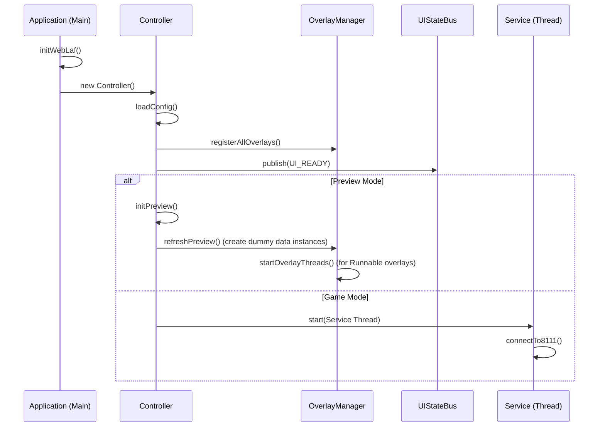
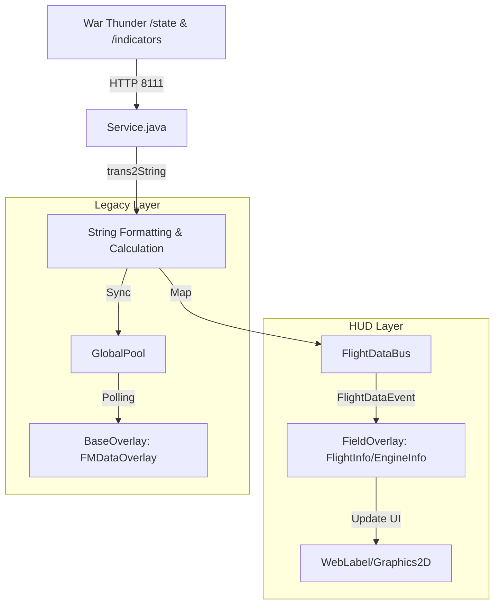
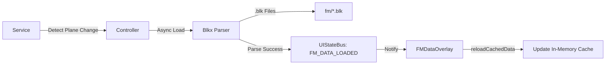

# VoidMei 技术架构与流转分析规范 (Architecture & Flow Analysis)

本文档旨在为 Committer 和核心开发人员提供 VoidMei 项目的全局技术图谱。由于项目已演进至 10,000+ 行代码量，本文档通过详细的架构图和流转说明，帮助开发者快速理解模块间的解耦方案及核心逻辑。

---

## 1. 核心架构总览 (System High-Level)

VoidMei 采用**“中心控制 + 双总线驱动”**的架构模式。

*   **中心控制**: `Controller` 是所有模块的集散地，管理生命周期与模式切换。
*   **控制总线 (UIStateBus)**: 基于 `prog.event.UIStateEvents`，负责系统级的生命周期事件（如 UI 就绪、FM 加载、配置变更）。
*   **数据总线 (FlightDataBus)**: 负责高频、实时的遥测数据流动（从游戏到 HUD）。

---

## 2. 控制流分析 (Control Flow)

控制流描述了程序从启动到销毁的路径，以及 UI 模式之间的切换逻辑。

### 2.1 启动与生命周期

**关键点说明**:
1.  **OverlayManager 线程隔离**: 在 `Controller` 中注册 Overlay 时，如果需要后台刷新，`OverlayManager` 会在 `refreshPreview` 或 `open` 时按需启动线程。
2.  **启动延迟**: `Controller` 在启动 Overlays 前会有 100ms-2000ms 的延迟，以确保底层 Data Pool 和 Service 完全就绪，防止 UI 闪烁。

---

## 3. 数据流分析 (Data Flow)

数据流描述了如何将 War Thunder 的原始数据转化为用户看到的直观 HUD 信息。

### 3.1 实时遥测数据流 (Telemetry Path)
这是系统中最繁忙的路径，处理频率通常在 10ms-300ms 之间。

**详尽流说明**:
1.  **采集层**: `Service` 线程通过 `HttpHelper` 轮询游戏的 8111 端口。
2.  **处理层**: `Service.trans2String()` 执行复杂的物理计算（如 SEP 能量变化率、转弯半径等）并将结果序列化为字符串。
3.  **分发层**: 
    *   **现代路径**: 调用 `FlightDataBus.publish()`。所有订阅了相应 Keys 的 `FieldOverlay` 子类会接收到 `FlightDataEvent` 并刷新 Label。
    *   **兼容路径**: 同步更新 `Controller.globalPool`，供基于轮询的 `BaseOverlay` 使用。
4.  **展示层**: `FieldOverlay` 根据 `Config` 中定义的 Keys 自动映射。

### 3.2 飞机气动模型流 (Flight Model Path)
处理载具切换时的底层数据加载。

**详尽流说明**:
1.  `Service` 发现玩家更换了载具名称。
2.  `Controller` 触发 `loadFm()`，这是一个异步过程。
3.  `Blkx` 递归解析嵌套的配置文件，获取推力曲线、升力系数等。
4.  一旦解析完成，通过 `UIStateBus` 发布 `FM_DATA_LOADED` 信号，`FMDataOverlay` 收到后更新其内部缓存，并等待渲染循环刷新。

---

## 4. 关键组件依赖关系 (Critical Component Map)

| 组件 (Class) | 职责 | 修改风险 / 侧应点 |
| :--- | :--- | :--- |
| `Controller` | 协调器、配置桥接 | 修改此处可能导致全局模式切换（预览/游戏）失效。 |
| `Service` | 数据泵、物理计算 | 修改计算公式（如 SEP）会影响多个 HUD 面板的准确性。 |
| `OverlayManager` | 窗口管家、线程工厂 | **核心修复点**：若 Runnable Overlays 不更新，检查其线程启动逻辑。 |
| `BaseOverlay` | UI 基类、拖拽实现 | 这里的修改会影响所有子类（FlightInfo, FMData 等）的界面行为。 |
| `FlightDataBus` | 数据解耦 | 如果数据不刷新但 Service 运行正常，检查 Listener 是否注册。 |

---

## 5. 开发者建议 (Committer Tips)

*   **新增面板**: 建议继承 `FieldOverlay`。只需定义 `Config` 类和对应的 `ui_layout.cfg` 条目，数据会自动通过 `FlightDataBus` 注入，无需手动编写刷新循环。
*   **复杂渲染**: 如果需要自定义图形绘制（如地平仪），请继承 `BaseOverlay` 并重载 `updateUI`。
*   **性能调优**: `Service` 的 `freq` 是最高限制，`BaseOverlay` 的 `getRefreshInterval` 是 UI 限速。尽量保持 `Service` 高频，而 UI 适当降低频率以节省性能。
