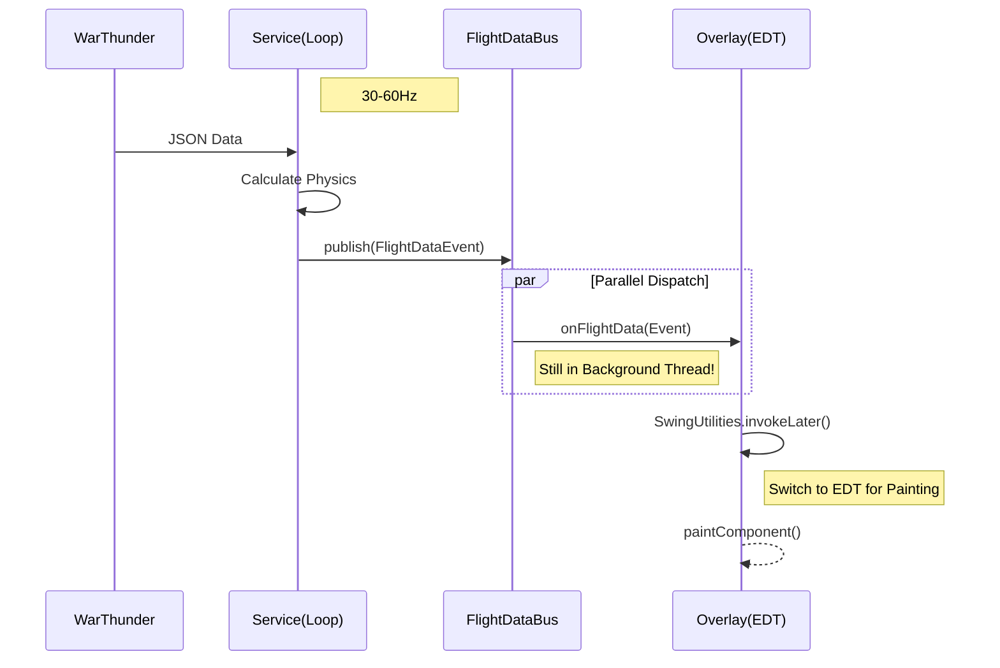
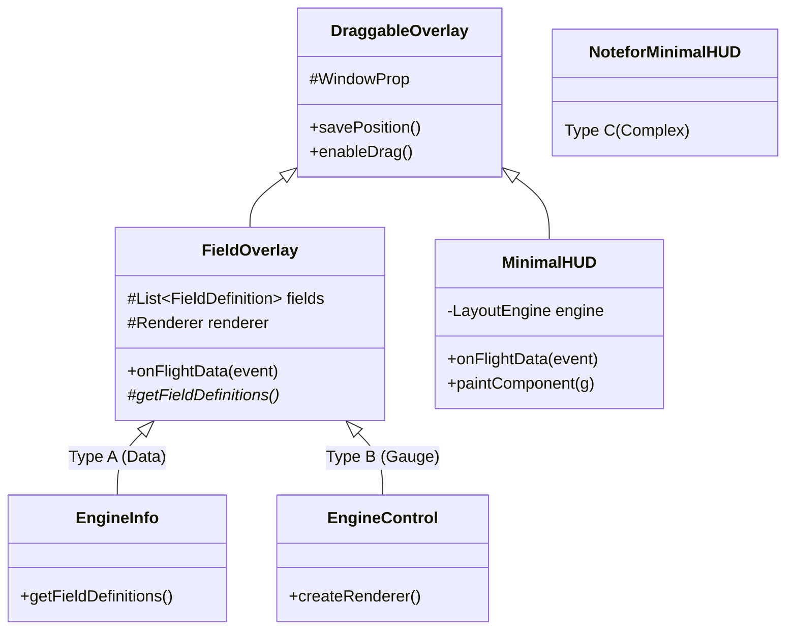
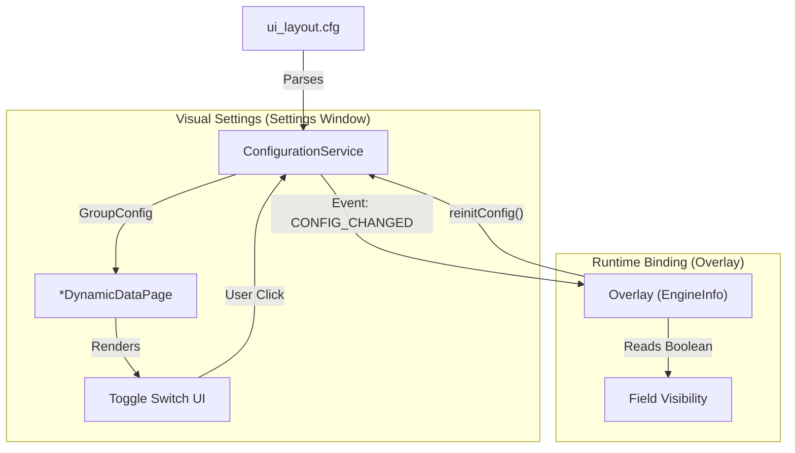
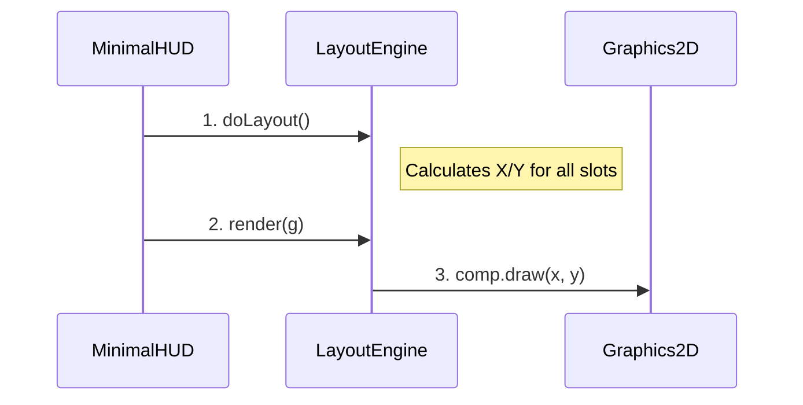
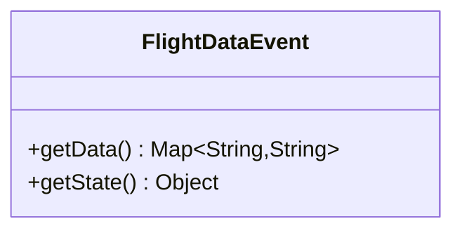

# VoidMei 架构师级开发手册 (Senior Architect Developer Guide)

> **版本 (Version)**: 2026.01
> **适用对象 (Target Audience)**: 高级 Java 开发者 / 系统架构师 / 核心贡献者
> **前置知识**: Java 8+, Swing/AWT, Design Patterns (GoF), Multithreading

本手册旨在深度剖析 VoidMei 的设计哲学、核心模式实现以及全生命周期的开发流程。它超越了基础的 "How-to"，更多关注 "Why" 和 "What if"。

---

## 1. 架构逻辑与核心哲学 (Architecture & Philosophy)

VoidMei 的架构设计围绕着 **高频实时性 (High Frequency Real-time)** 和 **模块自治 (Component Autonomy)** 展开。我们采用了一种改良的 **CQRS (命令查询职责分离)** 变体，配合 **双总线 (Twin-Bus)** 架构。

### 1.1 Publish-Subscribe Pattern (Pub/Sub) with Event Sourcing concepts.

为了解耦 **数据生产 (Service)** 与 **数据消费 (UI)**，我们构建了一个严格的广播系统：

*   **Service Layer (Publisher)**: 它是唯一的真理来源 (Source of Truth)。它以 30Hz-60Hz 的频率向总线“广播”飞行数据的快照。它完全不知道（也不关心）有多少个 Overlay 在监听，也不关心它们如何显示。
*   **The Bus (Medium)**: 光速传输介质。确保数据在不同线程间安全传递。
*   **Overlay Layer (Subscriber)**: 就像收音机。每个 Overlay 自行决定订阅哪个频道，听到数据后自行决定如何渲染（数字、仪表盘指针、或图表）。

### 1.2 数据流哲学：快照与不可变性 (Snapshot & Immutability)
在多线程高频渲染系统中，锁 (Locking) 是性能杀手。VoidMei 采用 **"只读快照" (Read-Only Snapshot)** 策略：
1.  Service 线程计算完一帧数据后，将其打包成一个 **不可变 (Immutable) 的 Map** 或 **Copy**。
2.  这个快照随事件发送给 UI。
3.  UI 线程读取这个快照进行渲染。
*   **结果**：UI 永远不会读到 "写了一半" 的数据，且无需加锁。

---

## 2. 设计模式审计 (Design Pattern Audit)

本项目并非简单的 CRUD 应用，而是密集使用了 GoF 设计模式来管理复杂性。理解这些模式通过 `src/` 下的代码如何体现，是阅读源码的钥匙。

### 2.1 观察者模式 (Observer Pattern)
*   **位置**: `src/prog/event/FlightDataBus.java`, `UIStateBus.java`
*   **实现**: 
    *   **Subject**: `FlightDataBus` (Singleton).
    *   **Observer**: `FlightDataListener` 接口。
    *   **Mechanism**: 使用 `CopyOnWriteArrayList` 存储监听器，确保在遍历通知时即使有新监听器加入也不会抛出 `ConcurrentModificationException`。
*   **架构价值**: 实现了核心的解耦。新增一个 Overlay 不需要修改 Service 的一行代码。

### 2.2 策略模式 (Strategy Pattern)
*   **位置**: `src/prog/OverlayManager.java`, `src/ui/layout/renderer/RowRendererRegistry.java`
*   **实现**:
    *   **ActivationStrategy**:通过 `Lambda (Functional Interface)` 动态决定一个 Overlay 是否应该在当前上下文（游戏模式/预览模式）打开。
    *   **RowRenderer**: `DynamicDataPage` 不包含巨大的 `switch-case`，而是根据配置类型（`SWITCH`, `SLIDER`, `COMBO`）从 Registry 中获取对应的渲染策略类 (`SwitchRowRenderer`, etc.)。
*   **架构价值**: 极大地消除了 `if-else` 逻辑，符合 **开闭原则 (OCP)**。添加新的配置控件类型只需注册一个新的 Renderer。

### 2.3 模板方法模式 (Template Method Pattern)
*   **位置**: `src/ui/base/FieldOverlay.java`
*   **实现**: `FieldOverlay` 定义了通用的数据接收、配置加载和窗口重绘流程（骨架）。
    *   **Hook Method**: `getFieldDefinitions()` 是抽象方法 (或需覆盖)，由子类 (`EngineInfo`) 提供具体的数据定义。
*   **架构价值**: 避免了在每个 Overlay 中重复编写 `subscribe`, `reinitConfig`, `paint` 等通用样板代码。

### 2.4 静态工厂/建造者 (Static Factory / Builder)
*   **位置**: `src/ui/replica/ReplicaBuilder.java` API
*   **实现**: 提供 `createSwitchItem`, `createSpinnerItem` 等静态方法。
*   **架构价值**: 封装了 WebLaF 复杂的组件初始化逻辑（布局、边距、样式装饰），让业务代码（`DynamicDataPage`）保持清晰可读。

### 2.5 单例模式 (Singleton Pattern)
*   **位置**: `FlightDataBus`, `UIStateBus`
*   **实现**: 简单的饿汉式加载 (`private static final instance = new ...`)。
*   **架构价值**: 保证全局唯一的通信通道。

---

## 3. 深度剖析：双总线系统 (Deep Dive: The Twin-Bus System)

VoidMei 将 **高频数据** 与 **低频控制** 物理隔离，使用了两条独立的总线。这是避免 UI 卡顿的关键设计。

### 3.1 FlightDataBus (高速公路)
*   **载荷**: `FlightDataEvent`
*   **触发**: 每帧 (Service Thread Loop)
*   **SLA**: 必须在 16ms 内处理完毕，禁止由 Event 触发重IO操作或复杂逻辑。



### 3.2 UIStateBus (控制中心)
*   **载荷**: `ConfigEvent` / `ControlEvent`
*   **触发**: 用户点击设置、拖动窗口、热键操作
*   **典型场景**:
    *   用户在设置面板切换 "显示 Overlay" -> Bus -> Overlay 收到 -> `setVisible(true)`
    *   用户点击 "重置布局" -> Bus -> 所有 Page -> `rebuild()`

### 3.3 为什么需要两条线？(The Segregation Principle)
如果将 "点击按钮" (UI Action) 和 "飞行数据" (Data Stream) 混在一条总线上：
1.  **噪音**: UI 组件会被每秒 60 次的数据淹没，难以过滤出 "按钮点击" 事件。
2.  **优先级**: UI 控制事件通常需要立即响应（高优先），而丢弃一帧飞行数据通常无伤大雅（低抖动敏感）。物理分离让我们能更容易地管理这些特性。

---

## 4. 对象模型与多态 (Object Model & Polymorphism)

VoidMei 的 Overlay 系统展示了如何处理 **"相似但不同" (Similar but Different)** 的组件。

### 4.1 类继承体系 (The Hierarchy)



### 4.2 差异管理技术 (Managing Variance)
1.  **配置驱动 (Type A)**: `EngineInfo` 几乎只有配置逻辑。它复用了 `FieldOverlay` 的渲染器。
    *   *技术手段*: 覆写 `getFieldDefinitions` 返回元数据列表。
2.  **渲染器替换 (Type B)**: `EngineControl` 需要画进度条而不是文字。
    *   *技术手段*: 覆写 `createRenderer()` 返回 `LinearGaugeRenderer`。这是 **策略模式** 的另一种体现。
3.  **完全重写 (Type C)**: `MinimalHUD` 逻辑太复杂，无法复用通用逻辑。
    *   *技术手段*: 直接继承基类 `DraggableOverlay`，手动实现 `onFlightData`，拥有完全独立的绘图循环 (`paintComponent`)。

这种设计允许系统同时拥有 "低开发成本的通用面板" 和 "高性能的定制面板"。

---

## 5. Java 模式新手指南 (Java Patterns for Novices)

本节专为有 Java 基础但缺乏在复杂框架中实战经验的开发者准备。阅读本项目源码时，你会频繁通过以下模式与代码交互。

### 5.1 泛型与 Supplier 接口 (Generics & Suppliers)
在 `OverlayManager.java` 中，你看到这样的签名：
```java
public <T> void register(String key, Supplier<T> factory)
```
*   **解读**: `<T>` 是一个占位符。当你调用 `register("id", () -> new MyOverlay())` 时，`T` 自动变成了 `MyOverlay` 类型。
*   **用途**: `Supplier<T>` 不会立即创建对象，而是把 "如何创建对象" 这个行为存储起来。系统可以在需要的时候（比如用户开启了开关）再调用 `factory.get()` 来创建对象，从而节省内存。

### 5.2 Lambda 与 Functional Interfaces
你会看到大量的 `() -> action` 写法。
*   **场景**: `SwingUtilities.invokeLater(() -> ...)`
*   **解读**: 这是一个 `Runnable` 接口的简化写法。它告诉 Java："把这块代码打包成一个任务，放到 UI 线程的待办队列里，稍后再执行"。
*   **陷阱**: Lambda 表达式引用的外部变量必须是 effectively final (不可变)。如果你需要在 Lambda 里修改计数器，请使用 `AtomicInteger` 或成员变量。

---

## 6. 端到端实战教学 (E2E Implementation Guide)

假设产品需求：新增一个 **“过载警告 (G-Force Warning)”** 功能，当过载超过 5G 时，在屏幕上显示红色警告。

### Step 1: 数据感知 (Service Layer)
在 `src/prog/Service.java` 中找到计算逻辑处。
```java
// updateGlobalPool()
double currentG = sState.Ny;
// 放入 Map
data.put("current_g_load", String.format("%.1f", currentG));
data.put("warn_g_limit", currentG > 5.0 ? "true" : "false");
```

### Step 2: 声明配置 (Config Layer)
在 `ui_layout.cfg` 中添加一个新组或条目。
```lisp
(panel "过载警告"
  (item "启用过载警告" :type switch :target "enableGForceWarn" :default true)
  (item "当前G值" :type data :target "current_g_load" :format "%s G")
)
```

### Step 3: 根据需求选择策略 (Decision Time)
*   **策略 A (只是显示数值)** -> 使用 `Type A` (配置驱动)。结束！`FieldOverlay` 会自动处理。
*   **策略 B (有特殊绘制逻辑 - 红色闪烁)** -> 需要 `Type B` 或 `C`。

让我们选择 **Type C (MinimalHUD)** 的扩展方式，因为我们需要在屏幕中心画一个红色大字。

### Step 4: 编写 UI 组件 (Component Implementation)
在 `src/ui/component/` 下新建 `GForceWarning.java`。
```java
public class GForceWarning extends HUDComponent {
    private boolean isWarn = false;
    
    @Override
    public void onDataUpdate(HUDData data) {
        // 从 Map 中读取我们在 Step 1 放入的 boolean 字符串
        this.isWarn = "true".equals(data.rawMap.get("warn_g_limit"));
    }

    @Override
    public void draw(Graphics2D g, int x, int y) {
        if (!isWarn) return;
        g.setColor(Color.RED);
        g.setFont(new Font("Arial", Font.BOLD, 40));
        g.drawString("OVER G!", x, y);
    }
}
```

### Step 5: 注册组件 (Registration)
在 `MinimalHUD.java` 的 `initComponentsLayout` 中：
```java
GForceWarning warning = new GForceWarning();
addComponent(warning); // 加入数据订阅链
registerComponent(warning, HUDLayoutSlot.MIDDLE_CENTER); // 放在屏幕正中间
```

### Step 6: 验证 (Verification)
1.  运行 `./script/build.sh`。
2.  进入游戏（或重放），进行大机动。
3.  观察屏幕中心是否出现红色警告。

---

## 7. 专家级内幕与边缘情况 (Expert Internals & Edge Cases)

### 7.1 DSL 绑定的"黑盒" (DSL Binding Internals)
**流程图**:

*   **技术债 (Tech Debt)**：对于老一代 Overlay (`EngineInfo`)，Java 代码依赖 hardcoded Map (`LABEL_TO_KEY`) 将配置项的 Label 反向映射到 Key。
*   **避坑**: 新代码请直接使用 `:target` Key。

### 7.2 布局引擎 (Layout Engine)
**Type C** 委托给 `HUDVirtualLayoutEngine` 处理堆叠。
*   **时序图**:

*   **避坑**: 不要手动计算坐标，使用 `HUDLayoutSlot`。

### 7.3 国际化硬编码 (Static I18N)
*   **技术债**: `Lang.java` 是纯静态字段。
*   **避坑**: 添加翻译必须修改三个地方：`.properties` 文件 -> `Lang.java` 字段声明 -> `Lang.initLang()` 赋值。漏掉任何一步都会导致 `null` 异常或显示空白。

### 7.4 事件载荷的双重性 (Event Duality)

*   **Map (推荐)**: 线程安全。
*   **State (慎用)**: 如果你必须进行极高性能的物理计算（如能量机动理论验证），你可以访问 `getState()` 获取原始对象。**警告**：该对象非线程安全，严禁修改。

### 7.5 配置持久化陷阱 (Persistence Trap)
`ConfigurationService` 的保存逻辑基于 `ui_layout.cfg` 的结构树。
*   **陷阱**: 如果你在代码里 `new` 了一个 Overlay 但没有在配置文件里定义它，系统不知道把它存到哪里。它的位置信息会在重启后丢失。
*   **规则**: **No Config Entry, No Persistence.**

---

## 8. 常见问题 (FAQ)

*   **Q: 为什么我的 Overlay 不显示？**
    *   A: 1. 检查 `ui_layout.cfg` 开关。 2. 检查 `init()` 是否被调用。 3. 检查坐标是否飞出屏幕 (查看日志 `[OverlaySettings]`).
*   **Q: 如何调试多语言？**
    *   A: 修改 properties 文件后必须重启程序，无法热重载。
*   **Q: 预览模式下窗口位置是对的，进游戏就乱了？**
    *   A: 检查 `ui_layout.cfg` 中的坐标百分比。游戏分辨率可能与桌面分辨率不同。系统使用相对坐标 (`0.5` = 50%) 来适配不同分辨率。

---
*文档维护者: VoidMei Dev Team*
