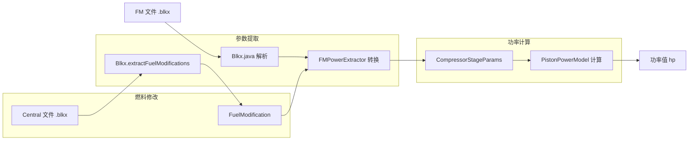

# VoidMei 功率曲线调试手册

> **作者**: VoidMei 核心贡献者
> **目标读者**: 需要验证或调试活塞发动机功率计算的开发者

## 1. 概述

VoidMei 的活塞发动机功率计算基于 WAPC (wt-aircraft-performance-calculator) 的算法实现。
当功率曲线出现异常时，可以使用本手册中的方法进行对比调试。

### 工作原理



**关键文件**:

| 文件 | 职责 |
|------|------|
| `src/parser/Blkx.java` | 解析 FM 文件和 Central 文件的燃料修改 |
| `src/prog/util/FMPowerExtractor.java` | FM 参数 → CompressorStageParams 转换（含燃料加成） |
| `src/prog/util/PistonPowerModel.java` | 功率计算核心（variabler + equationer） |
| `src/prog/util/PowerCurveHelper.java` | 功率曲线形状判断辅助函数 |
| `src/prog/util/AtmosphereModel.java` | ISA 大气模型、RAM 效果计算 |

---

## 2. 对比调试方法

使用 WAPC 的 `single_aircraft_calculator.py` 作为参考基准。

### 2.1 WAPC 参考计算

```bash
cd /path/to/wtapc/performance_calculators

# 基本用法 (静态、军用模式)
python3 single_aircraft_calculator.py \
    --fm /path/to/fm/yak-3.json \
    --central /path/to/yak-3.json \
    --octane true \
    --speed 0 \
    --modes military

# 带速度和 WEP
python3 single_aircraft_calculator.py \
    --fm /path/to/fm/f4u-4b.json \
    --speed 300 \
    --modes military WEP
```

**参数说明**:

| 参数 | 说明 |
|------|------|
| `--fm` | FM 文件路径 (JSON datamine 格式) |
| `--central` | Central 文件路径 (含 modifications 节) |
| `--octane` | 是否启用辛烷值加成 (true/false) |
| `--speed` | 空速 (km/h IAS)，0 = 静态 |
| `--modes` | 模式列表: military, WEP |
| `--alt_tick` | 高度步进 (默认 10m) |

### 2.2 VoidMei 侧验证

编写测试脚本调用 `optimalPowerAdvanced`（完整 WAPC 模型）对比：

```java
import static prog.util.PistonPowerModel.*;

double power = optimalPowerAdvanced(stages, alt, isWep, speed, isIAS, airTemp);
```

---

## 3. 日志输出

### 3.1 启用 DEBUG 日志

`PistonPowerModel.variabler()` 方法内置了 DEBUG 日志输出。

```java
import prog.util.Logger;

public class DebugScript {
    public static void main(String[] args) {
        // 启用 DEBUG 级别日志
        Logger.setMinLevel(Logger.Level.DEBUG);

        // 调用功率计算...
    }
}
```

### 3.2 日志输出示例

```
[23:21:25.495] [variabler ] [DEBUG] altRam=300.0, isWep=false | lower=(0.0, 1290.0), higher=(300.0, 1310.0), curv=1.0
```

### 关键字段说明

| 字段 | 说明 |
|------|------|
| `critAlt` | 临界高度 (m) - 增压器能维持最大增压的最高高度 |
| `critPower` | 临界功率 (hp) - 在临界高度的功率 |
| `deckPower` | 海平面功率 (hp) - 低于临界高度时的功率 |
| `ceilingAlt` | 升限高度 (m) - 功率曲线的参考终点 |
| `ceilingPower` | 升限功率 (hp) - 升限高度的功率 |
| `constRpmAlt` | ConstRPM 拐点高度 - constRPM 曲线弯折点 |
| `constRpmPower` | ConstRPM 拐点功率 |
| `ramAlt` | RAM 有效高度 - 考虑动压后的等效高度 |
| `lower/higher` | 插值边界 - (高度, 功率) 元组 |
| `curv` | 曲率系数 - 插值曲线的形状参数 |

---

## 4. 燃料修改 (Fuel Modifications)

### 4.1 概述

Central 文件 (`flightmodels/<飞机名>.blkx`) 的 `modifications` 节包含燃料升级信息，
会影响功率计算。VoidMei 通过 `Blkx.extractFuelModifications()` 提取这些修改，
在 `FMPowerExtractor.extractStages()` 中应用。

### 4.2 苏联燃料加成

**适用**: `ussr_fuel_b-95`, `ussr_fuel_b-100` (addHorsePowers = 50)

**效果**: 全部功率值 × 1.018 (1.8% 增益)

**应用顺序** (与 WAPC 一致):
```
soviet_octane_adder → definition_alt_power_adjuster → deck_power_maker → wep_mulitiplierer
```

**影响的参数**: `critPower`, `deckPower` (仅 stage 0), `constRpmPower`, `ceilingPower`

**示例 (Yak-3)**:
```
无燃料修改: critPower=1310, deckPower=1290
B-100加成后: critPower=1334, deckPower=1313  (×1.018)
```

### 4.3 英国燃料加成

**适用**: `150_octan_fuel` (afterburnerMult > 0)

**效果**: 修改 WEP 功率乘数和 WEP 临界高度

**注意**: 当 `invertEnableLogic=true` 时，高辛烷是默认值，加成不应用。

### 4.4 调试燃料修改

```java
// 检查 Central 文件是否被正确解析
Blkx.FuelModification fuelMod = Blkx.extractFuelModifications(centralData);
System.out.println("Type: " + fuelMod.type);
System.out.println("Soviet HP bonus: " + fuelMod.sovietOctaneHpBonus);

// 对比有无燃料修改的差异
CompressorStageParams[] noFuel = FMPowerExtractor.extractStages(blkx);
CompressorStageParams[] withFuel = FMPowerExtractor.extractStages(blkx, fuelMod);
```

---

## 5. 参数提取链路

当怀疑参数提取有问题时，检查以下链路：

### 5.1 Blkx.java 解析

```java
// 关键参数位置
compAlt[i] = getdouble("Compressor.Altitude" + i);
compPower[i] = getdouble("Compressor.Power" + i);
compCeil[i] = getdouble("Compressor.Ceiling" + i);
compCeilPwr[i] = getdouble("Compressor.PowerAtCeiling" + i);
compConstRpmAlt[i] = getdouble("Compressor.AltitudeConstRPM" + i);
compConstRpmPower[i] = getdouble("Compressor.PowerConstRPM" + i);
compRpmRatio[i] = getdouble("Compressor.PowerConstRPMCurvature" + i);
```

### 5.2 FMPowerExtractor 转换

```java
// Pass 0: 燃料修改（苏联辛烷值加成）
// 在其他处理之前应用，与 WAPC 的 soviet_octane_adder 位置一致

// Pass 1: 基础参数映射
stages[i].critAlt = blkx.compAlt[i];
stages[i].critPower = blkx.compPower[i];

// Pass 2: RPM 调整 (definition_alt_power_adjuster)
if (needsRpmAdjustment) {
    adjustPowerAndAltitude(stages[i], blkx, i, defaultRpm, stageDeckPower);
}

// Pass 3: Deck Power 计算 (deck_power_maker)
// Stage 0: deckPower = Main.Power (已含燃料加成)
// Stage 1+: deckPower = 0.8 × 上一级 deckPower

// Pass 4: WEP 参数计算 (wep_mulitiplierer + 英国辛烷值)
stages[i].wepPowerMult = calculateWepMultiplier(blkx, i);
stages[i].wepCritAlt = calculateWepCriticalAltitude(blkx, stages[i], i);
```

### 5.3 PowerCurveHelper 形状判断

```java
// 判断 ConstRPM 是否存在
hasConstRpm(p)              // constRpmPower > 0

// 判断 ConstRPM 弯折点位置
constRpmBelowCritAlt(p)     // constRpmAlt < critAlt (两段曲线)
constRpmAboveCritAlt(p)     // 特殊情况: P-63 等

// 判断 ceiling 是否有效
ceilingIsUseful(p)          // 高度差 >= 2 且功率差 >= 2
```

---

## 6. 常见问题排查

### Q: 静态功率 (speed=0) 不匹配

**检查点**:
1. `deckPower` 是否正确 (Stage 0 = `Main.Power`, Stage 1+ = 0.8 × 上一级)
2. `critAlt` 和 `critPower` 是否正确读取
3. `curvature` (PowerConstRPMCurvature) 是否为正确值
4. **燃料修改是否被正确应用** — 检查 Central 文件是否存在

### Q: RAM 效果下功率不匹配

**检查点**:
1. `speedManifoldMult` (SpeedManifoldMultiplier) 是否正确
2. RAM 有效高度计算：`AtmosphereModel.ramEffectAltitude()`
3. VoidMei 使用 `double`，WAPC 使用 `int()` 截断（通常影响 < 1 hp）

### Q: WEP 功率不匹配

**检查点**:
1. `wepPowerMult` 计算是否正确
2. 当 `wepPowerMult ≈ 1.0` 时应短路返回军用功率
3. `AfterburnerBoostMul` 是否显式设为 0（禁用该级 WEP）
4. **英国燃料修改** — 检查 `afterburnerMult` 是否被正确应用

### Q: 多级增压器级别选择不匹配

**检查点**:
1. `optimalPowerAdvanced()` 应选择功率最大的级别
2. 检查每个级别的 `deckPower` 计算

### Q: ConstRPM 飞机功率曲线不匹配

**检查点**:
1. `hasConstRpm()` 只检查 `constRpmPower > 0`，**不检查** `constRpmAlt`
2. `constRpmAlt=0` 是合法值，表示 ConstRPM 在海平面（如 F4U-4B stage 1）
3. WAPC 的 `ConstRPM_is()` 检查字典键是否存在，而非值是否为零
4. 当 `constRpmPower == critPower` 时，该区间功率应为平坦段

### Q: 高空功率偏差大

**检查点**:
1. 确认使用 `optimalPowerAdvanced`
2. `ceilingIsUseful()` 是否返回正确值
3. `ExactAltitudes` 标志是否正确 — 影响 ceiling 区间的插值方式

---

## 7. 测试用例模板

如需为新飞机创建验证测试：

```java
import parser.Blkx;
import prog.i18n.Lang;
import prog.util.FMPowerExtractor;
import prog.util.Logger;
import prog.util.PistonPowerModel.CompressorStageParams;
import static prog.util.PistonPowerModel.*;

public class VerifyXXX {

    private static final String FM_PATH = "/path/to/fm/xxx.blkx";

    // WAPC reference values (from single_aircraft_calculator.py)
    private static final double[][] WAPC_MIL = {
        {0, /* power */}, {1000, /* power */}, /* ... */
    };

    public static void main(String[] args) {
        Logger.setMinLevel(Logger.Level.INFO);
        initLang();

        Blkx blkx = new Blkx(FM_PATH, "xxx");
        // Optional: load Central file for fuel modification
        // Blkx.FuelModification fuelMod = Blkx.extractFuelModifications(centralData);

        CompressorStageParams[] stages = FMPowerExtractor.extractStages(blkx);

        double maxDiff = 0;
        for (double[] ref : WAPC_MIL) {
            int alt = (int) ref[0];
            double wapcPwr = ref[1];
            double ourPwr = optimalPowerAdvanced(stages, alt, false, 300, true, 15);
            double diff = Math.abs(ourPwr - wapcPwr);
            if (diff > maxDiff) maxDiff = diff;
            System.out.printf("%-8d WAPC=%-10.1f Ours=%-10.1f Diff=%-8.1f%n",
                alt, wapcPwr, ourPwr, diff);
        }

        System.out.printf("Max diff: %.1f hp%n", maxDiff);
        System.out.println(maxDiff < 1.0 ? "PASS" : "FAIL");
    }

    private static void initLang() {
        Lang.bFmVersion = "FM: %s - %s\n";
        Lang.bWeight = "Empty: %.1f kg, Max Fuel: %.1f kg\n";
        Lang.bCritSpeed = "Critical Speed: [%.0f, %.0f] km/h\n";
        Lang.bAllowLoadFactor = "G-limits: [%.1f, %.1f] (full), [%.1f, %.1f] (half fuel)\n";
        Lang.bFlapRestrict = "Flap %d: [%.0f%%, %.0f km/h]\n";
        Lang.bEffSpeedAndPowerLoss = "Eff Speed (E/A/R): %.0f/%.0f/%.0f, Power Loss: %.1f/%.1f/%.1f\n";
        Lang.bNitro = "Nitro: %.1f kg, Duration: %.1f min\n";
        Lang.bAverageHeatRecovery = "Avg Heat Recovery: %.2f\n";
        Lang.bMaxLiftLoad350 = "Max Lift Load: %.2f / %.2f\n";
        Lang.bInertia = "Inertia (P/R/Y): %.0f / %.0f / %.0f\n";
        Lang.bLift = "Wing: %.1f m2, Fuse: %.1f m2, WLL: %.2f / %.2f, Oswald: %.2f, AR: %.1f, Sweep: %.1f\n";
        Lang.bDrag = "CdS: %.3f / %.3f, IndCd: %.4f / %.0f, Rad/Oil: %.3f / %.3f\n";
        Lang.bFmParts = "--- %s ---\n";
        Lang.bCdMin = "CdMin: %.4f\n";
        Lang.bCl0 = "Cl0: %.4f\n";
        Lang.bAoACrit = "AoACrit: [%.1f, %.1f]\n";
        Lang.bAoACritCl = "ClCrit: [%.2f, %.2f]\n";
        Lang.noblkx = "No FM loaded";
    }
}
```

---

## 8. 已验证飞机

以下飞机已通过 WAPC 对比验证，可作为参考基准。

### 8.1 Yak-3 (苏联燃料修改)

2 级增压器，Soviet B-100 燃料 (addHorsePowers=50, ×1.018)

| 高度 (m) | 功率 (hp) | 备注 |
|----------|-----------|------|
| 0 | 1313.2 | 海平面（含 1.8% 燃料加成） |
| 300 | 1333.6 | 峰值功率（stage 0 临界高度） |
| 1000 | 1216.0 | |
| 2000 | 1218.2 | |
| 3000 | 1199.4 | |
| 5000 | 921.4 | |
| 9000 | 519.2 | |
| 10000 | 444.8 | |

**与 WAPC 偏差**: < 0.1 hp

### 8.2 F4U-4B (3 级增压器，WEP)

3 级增压器，ConstRPM 在海平面 (constRpmAlt=0)，300 km/h IAS

**Military:**

| 高度 (m) | 功率 (hp) | 备注 |
|----------|-----------|------|
| 0 | 2300.0 | 海平面 |
| 2000 | 2000.0 | Stage 1 flat (constRPM=critPower) |
| 5000 | 2000.0 | Stage 1 flat 持续到此 |
| 7000 | 1850.0 | Stage 2 临界高度 |
| 10000 | 1337.6 | |

**WEP:**

| 高度 (m) | 功率 (hp) | 备注 |
|----------|-----------|------|
| 0 | 2688.0 | 海平面 WEP |
| 1000 | 2602.6 | WEP flat 段开始 |
| 4000 | 2602.6 | WEP flat 段结束 |
| 7000 | 2241.9 | |
| 10000 | 1480.2 | |

**与 WAPC 偏差**: Military < 0.7 hp, WEP < 0.7 hp

---

## 9. 功率曲线窗口标签系统

`PowerCurveWindow.java` 会在功率曲线的关键位置自动绘制标签，帮助用户理解增压器特性。

### 9.1 标签类型

| 标签格式 | 颜色 | 含义 | 检测条件 |
|----------|------|------|----------|
| `"1档"`, `"2档"` | 金色 | 增压器临界高度（功率峰值） | 斜率从正变负 + 突出度 > 1% |
| `"1→2档"`, `"2→3档"` | 蓝色 | 增压器档位切换点 | 斜率从负变正 + 突出度 > 1% |
| `"Kink"` | 紫色 | 斜率突变点（ConstRPM 折点等） | 同向斜率但变化 > 阈值 |

### 9.2 检测优先级

标签按以下顺序添加，先添加的标签会阻止后续标签在 300m 范围内出现：

1. **Valley（档位切换）** — 最高优先级
2. **Peak（临界高度）** — 次之
3. **Kink（斜率突变）** — 最低

### 9.3 档位编号规则

- 档位编号从 **1** 开始（非 0）
- Peak 按高度排序：第 1 个 Peak = "1档"，第 2 个 = "2档"...
- Valley 的编号基于其下方的 Peak 数量：
  - 下方有 N 个 Peak → 标记为 `"N→N+1档"`

### 9.4 预期标签示例

| 飞机类型 | 预期标签 |
|----------|----------|
| 单级增压器 | `"1档"` |
| 双级增压器 | `"1档"`, `"1→2档"`, `"2档"` |
| 三级增压器 | `"1档"`, `"1→2档"`, `"2档"`, `"2→3档"`, `"3档"` |

### 9.5 检测算法

```java
// Phase 1: 收集峰值和谷值候选点
for (int i = hw; i <= maxIdx - hw; i++) {
    double leftSlope = center - left;   // 左侧斜率（功率变化）
    double rightSlope = right - center; // 右侧斜率

    // Peak: 斜率 + → - 且突出度足够
    boolean isPeak = leftSlope > 0 && rightSlope < 0
        && (center - min(left, right)) > noiseThreshold;

    // Valley: 斜率 - → + 且凹陷度足够
    boolean isValley = leftSlope < 0 && rightSlope > 0
        && (max(left, right) - center) > noiseThreshold;
}

// Phase 2: Valley 优先添加（带 "X→Y档" 标签）
// Phase 3: Peak 添加（带 "X档" 标签）
// Phase 4: Kink 检测（同向斜率突变）
```

### 9.6 阈值参数

| 参数 | 值 | 说明 |
|------|-----|------|
| `noiseThreshold` | `maxPower × 1%` | 过滤噪声的最小突出度 |
| `minSepM` | 300m | 标签最小间距 |
| `hw` | 4 (100m) | 斜率计算窗口半宽 |
| `kinkThreshold` | `max(avgSlope × 2.5, 0.08)` | Kink 检测的斜率变化阈值 |

---

## 10. 双 FM 对比模式

`PowerCurveWindow` 支持同时显示两条功率曲线，用于对比不同飞机的发动机性能。

### 10.1 使用方法

```java
// 单曲线模式（向后兼容）
new PowerCurveWindow(parent, "bf-109f-4", 400, true);

// 双曲线对比模式
new PowerCurveWindow(parent, "bf-109f-4", "p-51c-10-nt", 400, true);
```

在 UI 中，从 `ButtonRowRenderer` 自动读取 `selectedFM0` 和 `selectedFM1` 配置。

### 10.2 配色方案

| 元素 | FM0 (绿色系) | FM1 (青色系) |
|------|-------------|-------------|
| 曲线 | `#2EFF71` 霓虹绿 | `#00D4FF` 青色 |
| 峰值标记 | `#FFD700` 金色 | `#FF80B4` 粉色 |
| 谷值标记 | `#64C8FF` 浅蓝 | `#FF9966` 橙色 |
| 拐点标记 | `#B482FF` 紫色 | `#82FFB4` 薄荷绿 |

### 10.3 数据结构

每条曲线的数据封装在 `CurveData` 类中：

```java
private static class CurveData {
    final String fmName;
    final double[] powerCurve;
    final double maxPower, minPower;
    final int peakAltitude;
    final List<InflectionPoint> inflectionPoints;
    final String errorMessage;  // null 表示成功
    final Color curveColor, peakColor, valleyColor, kinkColor;

    boolean isValid() { return errorMessage == null && powerCurve != null; }
}
```

### 10.4 标签防重叠算法

双曲线模式下，两条曲线的标签可能重叠。`resolveCollisions()` 方法使用以下策略：

1. **收集所有标签**：从两条曲线的 inflection points 创建 `LabelPosition` 对象
2. **按 Y 坐标排序**：按高度从低到高排列
3. **检测碰撞**：使用 `Rectangle.intersects()` 检测边界框重叠
4. **解决碰撞**：
   - **策略 1**：将 FM1 标签翻转到标记点另一侧
   - **策略 2**：向下偏移 Y 坐标 (overlap + 5px)

```java
private static class LabelPosition {
    int markerX, markerY;      // 标记点位置
    int labelX, labelY;        // 标签文本位置
    int labelWidth, labelHeight;
    boolean isLeftSide;        // 标签在标记点左侧
    int curveIndex;            // 0=FM0, 1=FM1

    Rectangle getBounds();     // 返回标签边界框
    void flipSide();           // 翻转到另一侧
    void offsetY(int delta);   // 垂直偏移
}
```

### 10.5 图例

双曲线模式时，在图表右上角显示图例：

```
─── bf-109f-4      (绿色线段)
─── p-51c-10-nt    (青色线段)
```

### 10.6 错误处理

| 场景 | 行为 |
|------|------|
| `fm1 == fm0` | 自动切换为单曲线模式（无图例） |
| fm1 加载失败 | 显示 fm0 曲线 + fm1 错误提示（橙色文字） |
| fm0 加载失败 | 显示 fm1 曲线 + fm0 错误提示 |
| 两者都失败 | 显示组合错误信息 |
| fm1 不是活塞机 | 显示 fm0 曲线 + "fm1 不是活塞引擎" 提示 |

### 10.7 显示范围合并

双曲线模式下，Y 轴（功率）范围自动合并两条曲线：

```java
private void calculateDisplayRange() {
    double combinedMax = Math.max(curveData0.maxPower, curveData1.maxPower);
    double combinedMin = Math.min(curveData0.minPower, curveData1.minPower);

    // 向上/下取整到 100hp 边界
    displayMaxPower = Math.ceil(combinedMax / 100.0) * 100;
    displayMinPower = Math.floor(combinedMin / 100.0) * 100;
}
```

这确保两条曲线都完整显示在图表区域内。
