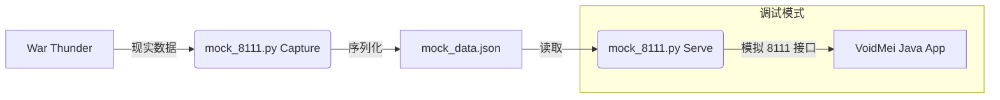

# VoidMei 打桩（Mock）调试手册

> **作者**: VoidMei 核心贡献者
> **目标读者**: 对 Java 熟悉但可能对 Python 不太了解的开发者

## 1. 为什么要“打桩”？

在开发 VoidMei 的 HUD 布局或逻辑时，如果每次都需要启动《战争雷霆》（War Thunder）并进入试飞，效率极低且极度消耗资源。
“打桩”技术通过一个轻量级的 Python 脚本，模拟游戏 8111 端口的行为，让 VoidMei 认为你正在飞行，从而实现**脱离游戏开发**。

### 工作原理



---

## 2. Python 环境准备

我们提供了一个专门的脚本 `script/mock_8111.py`。你可以通过以下两种方式运行它：

### 方案 A：使用 uv (推荐，最快)
如果你安装了 `uv`，无需关心依赖安装，直接运行即可。它会自动为你准备环境。

```bash
# 启动 mock 服务（监听 8112 端口）
uv run script/mock_8111.py serve --port 8112
```

### 方案 B：使用原生 pip
如果你更习惯传统的 Python 流程，请按以下步骤操作：

1. **安装依赖**:
   ```bash
   pip install requests psutil
   ```
2. **运行脚本**:
   ```bash
   python script/mock_8111.py serve --port 8112
   ```

---

## 3. 打桩脚本使用说明

脚本支持两个主要子命令：

### 3.1 捕获数据 (`capture`)
如果你想更新模拟的数据，可以在**游戏运行且正在飞行**时运行：
```bash
uv run script/mock_8111.py capture
```
这会将当前的飞行状态保存到 `script/mock_data.json`。

### 3.2 启动模拟 (`serve`)
在本地启动 HTTP 服务器，模拟 8111 端口：
```bash
uv run script/mock_8111.py serve --port 8112
```
> [!TIP]
> 建议使用 **8112** 端口，这样不会与真实的游戏进程（8111）冲突。

---

## 4. VoidMei 配置调整

为了让 Java 程序连接到你的 Mock 服务，你需要调整 UI 配置。

### 4.1 UI 界面配置 (最简单)
1. 启动 VoidMei。
2. 进入 `核心设置` -> `调试` 分组。
3. 找到 **8111端口** 输入框。
4. 将值从 `8111` 改为 `8112`。
5. **保存位置/配置**。程序会自动重新连接到 Mock 服务。

### 4.2 配置文件手动修改
你也可以直接编辑 `ui_layout.cfg`：

```clojure
  (group "调试"
    ;; 将 value 改为 8112
    (item "8111端口" :type input :target "httpPort" :value "8112" ...)
  )
```

---

## 5. 常见问题 (Troubleshooting)

### Q: 启动脚本报错 "Port 8111 is already in use by aces"
**原因**: 游戏正在运行，占用了 8111 端口。
**对策**: 
1. 换一个端口启动脚本：`--port 8112`。
2. 并在 VoidMei UI 中同步修改端口为 8112。

### Q: VoidMei 状态栏一直显示 "等待建立连接"
**原因**:
1. 脚本未成功启动。
2. 脚本端口与 VoidMei 配置端口不一致。
3. 脚本发送的数据格式不正确（VoidMei 对 `Header` 的行数有严格要求，确保使用的是最新版本的 `mock_8111.py`）。

---

## 6. 开发者进阶：自定义数据

如果你想调试特定的告警（如：过载告警），可以直接用文本编辑器打开 `script/mock_data.json`，修改其中的 `Ny` 值，Mock 服务会实时反映这些变化。

```json
{
  "state": { "Ny": 9.5, "IAS": 800, ... },
  "indicators": { "type": "f-16c", ... }
}
```

希望这份手册能帮助你高效开发！如有问题，请在内部群反馈。
