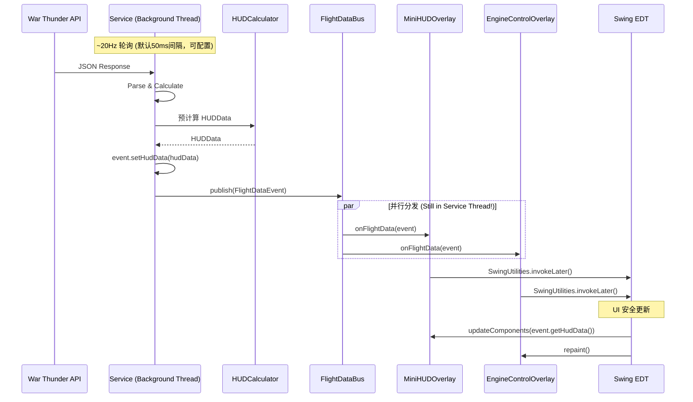
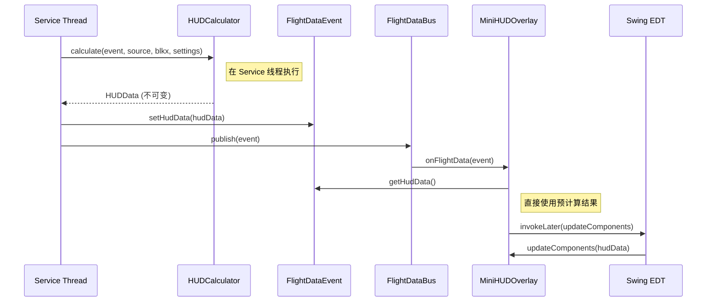
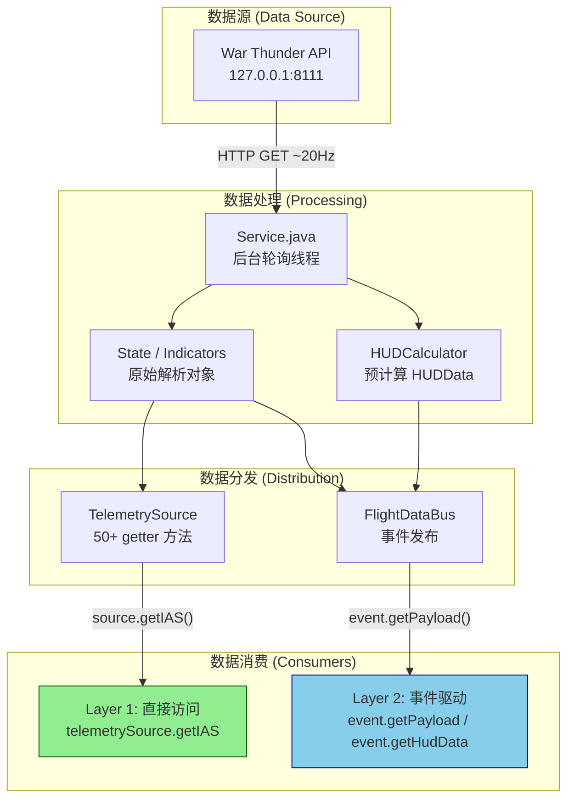

# VoidMei 数据流架构指南 (Data Flow Architecture Guide)

> **版本 (Version)**: 2026.02
> **适用对象 (Target Audience)**: 新贡献者 / HUD 组件开发者 / 性能优化工程师
> **前置知识**: Java 8 基础, 多线程基本概念

本指南详细说明 VoidMei 的两种数据传递方案：**TelemetrySource** 和 **FlightDataBus**。理解这些方案的使用场景和优先级是开发高性能 HUD 组件的关键。

---

## 1. 概述 (Overview)

VoidMei 采用**双通道数据架构**，同时存在两种数据传递方式，各有不同的设计目标和适用场景：

| 方案 | 实现 | 状态 | 适用场景 |
|------|------|------|----------|
| **Zero-GC 直接访问** | `TelemetrySource` 接口 | ✅ **推荐** | 高频数值 (IAS, Alt, SEP...) |
| **事件驱动** | `FlightDataBus` + `FlightDataEvent` | ✅ **推荐** | 组件解耦、低频逻辑标志 |

### 使用优先级 (Priority)

```
TelemetrySource   +   FlightDataBus
  (高频数值)           (事件通知)
```

**黄金法则**：
- 读取数值数据 → 使用 `TelemetrySource`
- 订阅数据更新 → 使用 `FlightDataBus`

---

## 2. TelemetrySource 接口 (Zero-GC Direct Access)

### 2.1 设计背景

VoidMei 以可配置的频率（默认 20Hz，即 50ms 间隔）轮询 War Thunder API，每次获取 50+ 个飞行参数。在原始实现中，所有数据都被转换为字符串存入 Map：

```java
// 旧方案的问题
data.put("TAS", String.valueOf(sState.TAS));  // Double → String 分配
data.put("IAS", String.valueOf(sState.IAS));  // 每帧 50+ 次分配
// 结果：500 次/秒的对象分配 → 频繁 GC → 帧率卡顿
```

**TelemetrySource** 的设计目标是**零内存分配**，直接返回原始类型。

### 2.2 接口定义

**文件位置**: `src/ui/model/TelemetrySource.java`

```java
public interface TelemetrySource {
    // 飞行数据 (Flight Data)
    double getIAS();        // 指示空速
    double getTAS();        // 真空速
    double getMach();       // 马赫数
    double getAoA();        // 迎角
    double getNy();         // 过载 (G-Force)
    double getVario();      // 爬升率

    // 高度与位置 (Altitude & Position)
    double getAltitude();
    double getRadioAltitude();
    boolean isRadioAltitudeValid();
    double getCompass();

    // 性能参数 (Performance)
    double getSEP();        // 单位剩余功率
    double getTurnRate();   // 转向率
    double getEnergyJKg();  // 比能量

    // 发动机 (Engine)
    double getThrottle();
    double getRPM();
    double getManifoldPressure();
    double getThrust();
    double getHorsePower();

    // 操纵面 (Control Surfaces)
    double getGear();
    double getFlaps();
    double getAileron();
    double getElevator();
    double getRudder();

    // 姿态仪数据 (Attitude Indicator)
    double getAviahorizonPitch();  // 俯仰角（度）
    double getAviahorizonRoll();   // 横滚角（度）

    // 更多方法... (共 50+ 个 getter)
}
```

### 2.3 实现位置

**文件**: `src/prog/Service.java`

`Service` 类实现 `TelemetrySource` 接口，直接返回内部计算字段：

```java
public class Service extends Thread implements TelemetrySource {

    private State sState;        // 原始游戏数据
    private double mach, An, nVy; // 计算字段

    @Override
    public double getIAS() {
        return sState != null ? sState.IAS : 0;  // 直接返回，无分配
    }

    @Override
    public double getMach() {
        return mach;  // 直接返回计算值
    }

    @Override
    public double getNy() {
        return An / g;  // 计算后返回
    }

    // ... 50+ 个实现方法
}
```

### 2.4 使用示例

**正确的 TelemetrySource 访问模式**（参考 `AttitudeOverlay.java`）：

```java
public class MyOverlay extends DraggableOverlay implements FlightDataListener {

    private Service xs;
    private ui.model.TelemetrySource telemetrySource;

    public void init(Controller c, Service s, OverlaySettings settings) {
        this.xs = s;
        // 正确方式：从 Service 转型获取 TelemetrySource
        if (s instanceof ui.model.TelemetrySource) {
            this.telemetrySource = (ui.model.TelemetrySource) s;
        }
        // 订阅数据总线
        FlightDataBus.getInstance().register(this);
    }

    @Override
    public void onFlightData(FlightDataEvent event) {
        SwingUtilities.invokeLater(() -> {
            if (telemetrySource == null) return;

            // 高频数值：通过 TelemetrySource 获取（零分配）
            double ias = telemetrySource.getIAS();
            double alt = telemetrySource.getAltitude();
            double aoa = telemetrySource.getAoA();

            // 低频逻辑字段：从类型安全的 EventPayload 获取
            EventPayload payload = event.getPayload();
            boolean isJet = payload.isJet;

            updateDisplay();
        });
    }

    @Override
    public void dispose() {
        FlightDataBus.getInstance().unregister(this);
        super.dispose();
    }
}
```

### 2.5 适用场景

| ✅ 适用 | ❌ 不适用 |
|---------|----------|
| 速度、高度、空速等数值 | 逻辑标志 (用 EventPayload: isJet, fatalWarn) |
| 发动机参数 (RPM, 油门) | 需要变更通知的场景 |
| 操纵面位置 (0.0-1.0) | 低频元数据 (mapGrid, timeStr) |
| 姿态仪数据 (pitch, roll) | 跨组件状态同步 |

### 2.6 优缺点分析

| 优点 | 缺点 |
|------|------|
| ✅ 零 GC 压力 | ❌ 紧耦合 (需持有 source 引用) |
| ✅ O(1) 直接访问 | ❌ 接口膨胀 (50+ 方法) |
| ✅ 类型安全 | ❌ 无推送通知 |
| ✅ IDE 自动补全 | ❌ 线程安全依赖调用方 |

---

## 3. FlightDataBus 事件系统 (Event-Driven)

### 3.1 设计背景

虽然 `TelemetrySource` 解决了 GC 问题，但它是**拉取模式** (Pull)——组件需要主动调用 getter。我们还需要一种**推送模式** (Push) 来：

1. 通知组件"数据已更新"
2. 解耦数据生产者 (Service) 和消费者 (Overlay)
3. 支持动态订阅/退订

### 3.2 核心组件

#### FlightDataBus (单例总线)

**文件**: `src/prog/event/FlightDataBus.java`

```java
public class FlightDataBus {
    private static final FlightDataBus INSTANCE = new FlightDataBus();
    private final List<FlightDataListener> listeners = new CopyOnWriteArrayList<>();

    public static FlightDataBus getInstance() {
        return INSTANCE;
    }

    public void register(FlightDataListener listener) {
        if (!listeners.contains(listener)) {
            listeners.add(listener);
        }
    }

    public void unregister(FlightDataListener listener) {
        listeners.remove(listener);
    }

    public void publish(FlightDataEvent event) {
        for (FlightDataListener listener : listeners) {
            try {
                listener.onFlightData(event);
            } catch (Exception e) {
                // 异常隔离：一个监听器失败不影响其他
                System.err.println("[FlightDataBus] Error: " + e.getMessage());
            }
        }
    }
}
```

#### EventPayload (类型安全载荷)

**文件**: `src/prog/event/EventPayload.java`

```java
public final class EventPayload {
    public final String mapGrid;              // 地图格子坐标 (如 "C5")
    public final boolean fatalWarn;           // 严重警告标志
    public final boolean radioAltValid;       // 无线电高度有效
    public final boolean isDowningFlap;       // 正在放襟翼
    public final String timeStr;              // 燃油时间字符串
    public final boolean isJet;               // 是否喷气机
    public final boolean engineCheckDone;     // 发动机检测完成
    public final int optimalCompressorStage;  // 最优压气机阶段 (0-based)，喷气机/单级=-1
    public final boolean compressorStageMismatch; // 满油门时实际阶段与最优不匹配

    // 通过 Builder 构建
    public static Builder builder() { return new Builder(); }
}
```

#### FlightDataEvent (事件对象)

**文件**: `src/prog/event/FlightDataEvent.java`

```java
public class FlightDataEvent {
    private final EventPayload payload;         // 类型安全的低频字段
    private final Object state;                 // parser.State 原始对象
    private final Object indicators;            // parser.Indicators 原始对象
    private final long timestamp;
    private HUDData hudData;                    // 预计算的 HUD 数据

    public EventPayload getPayload() { return payload; }
    public Object getState() { return state; }
    public Object getIndicators() { return indicators; }

    // HUDData 预计算支持
    public HUDData getHudData() { return hudData; }
    public void setHudData(HUDData data) { this.hudData = data; }
}
```

#### FlightDataListener (监听器接口)

```java
public interface FlightDataListener {
    void onFlightData(FlightDataEvent event);
}
```

### 3.3 数据流时序



### 3.4 使用示例

#### 订阅数据更新

```java
public class MyOverlay extends BaseOverlay implements FlightDataListener {

    private ui.model.TelemetrySource telemetrySource;

    @Override
    public void init(Controller c, Service s, OverlaySettings settings) {
        super.init(settings, this::generateLines);

        // 获取 TelemetrySource 引用
        if (s instanceof ui.model.TelemetrySource) {
            this.telemetrySource = (ui.model.TelemetrySource) s;
        }

        // 订阅数据总线
        FlightDataBus.getInstance().register(this);
    }

    @Override
    public void onFlightData(FlightDataEvent event) {
        // ⚠️ 重要：回调在 Service 线程，必须切换到 EDT
        SwingUtilities.invokeLater(() -> {
            // 模式 1: EventPayload 用于低频布尔标志
            EventPayload payload = event.getPayload();
            String mapGrid = payload.mapGrid;
            boolean fatalWarn = payload.fatalWarn;
            boolean isJet = payload.isJet;

            // 压气机优化相关字段
            int optStage = payload.optimalCompressorStage;  // 最优压气机阶段
            boolean mismatch = payload.compressorStageMismatch; // 阶段不匹配警告

            // 模式 2: TelemetrySource 用于高频数值（零 GC）
            if (telemetrySource != null) {
                double ias = telemetrySource.getIAS();
                double alt = telemetrySource.getAltitude();
            }

            updateDisplay();
        });
    }

    @Override
    public void dispose() {
        // ⚠️ 关键：必须退订，否则内存泄漏
        FlightDataBus.getInstance().unregister(this);
        super.dispose();
    }
}
```

### 3.5 事件数据结构

`EventPayload` 包含**低频逻辑字段**，全部类型安全：

| 字段 | 类型 | 说明 |
|------|------|------|
| `mapGrid` | `String` | 地图格子坐标 (如 "C5") |
| `fatalWarn` | `boolean` | 严重警告标志 |
| `radioAltValid` | `boolean` | 无线电高度有效 |
| `isDowningFlap` | `boolean` | 正在放襟翼 |
| `timeStr` | `String` | 燃油时间字符串 |
| `isJet` | `boolean` | 是否喷气机 |
| `engineCheckDone` | `boolean` | 发动机检测完成 |
| `optimalCompressorStage` | `int` | 最优压气机阶段 (0-based)，喷气机/单级增压器返回 -1 |
| `compressorStageMismatch` | `boolean` | 满油门时实际阶段与最优不匹配（用于增压器警告） |

**注意**：高频数值 (IAS, TAS, Alt...) **不在 EventPayload 中**，应通过 `TelemetrySource` 获取。

### 3.6 适用场景

| ✅ 适用 | ❌ 不适用 |
|---------|----------|
| 需要数据更新通知 | 高频数值读取 (用 TelemetrySource) |
| 组件解耦 | 同步阻塞调用 |
| 低频逻辑标志 | 大量数据传递 |
| 动态订阅/退订 | 需要返回值的场景 |

### 3.7 优缺点分析

| 优点 | 缺点 |
|------|------|
| ✅ 松耦合 | ❌ 监听器需自行切换 EDT |
| ✅ 动态订阅 | ❌ 事件流难以调试 |
| ✅ 统一更新时机 | ❌ 缺乏事件过滤机制 |
| ✅ 异常隔离 | |
| ✅ EventPayload 类型安全 | |

---

## 4. HUDData 预计算模式 (Pre-computation Pattern)

### 4.1 设计背景

MiniHUD 的 `HUDCalculator` 需要执行大量计算（单位转换、阈值判断、颜色映射）。如果在 EDT（Swing 事件派发线程）上执行这些计算，会增加 40-60ms 的 UI 延迟。

### 4.2 预计算架构



### 4.3 使用示例

```java
// Service.java - 在后台线程预计算 HUDData
HUDData hudData = HUDCalculator.calculate(event, this, blkx, hudSettings, null);
event.setHudData(hudData);
FlightDataBus.getInstance().publish(event);

// MiniHUDOverlay.java - 消费预计算的数据
@Override
public void onFlightData(FlightDataEvent event) {
    HUDData data = event.getHudData();  // 已在 Service 线程计算完成
    if (data == null) return;
    SwingUtilities.invokeLater(() -> updateComponents(data));
}
```

### 4.4 性能收益

| 指标 | 无预计算 | 有预计算 |
|------|----------|----------|
| EDT 阻塞时间 | 40-60ms | <5ms |
| 帧率稳定性 | 卡顿可能 | 稳定 |
| GC 压力 | 每帧计算分配 | 一次性分配 |

---

## 5. 数据流全景图 (Complete Data Flow)

### 5.1 双层消费者架构



### 5.2 轮询频率说明

VoidMei 的数据轮询频率是**可配置的**：

| 配置项 | 默认值 | 说明 |
|--------|--------|------|
| `serviceLoopIntervalMs` | 50ms (20Hz) | 主循环间隔，控制数据轮询和事件发布频率 |
| `engineInfoIntervalMs` | 100ms | 发动机信息面板刷新间隔 |
| `flightInfoIntervalMs` | 75ms | 飞行信息面板刷新间隔 |

用户可在 `ui_layout.cfg` 中调整 `serviceLoopIntervalMs` 来平衡性能和响应速度。

### 5.3 消费者层级说明

```
┌─────────────────────────────────────────────────────────────┐
│                    数据消费分层架构                          │
├─────────────────────────────────────────────────────────────┤
│                                                             │
│  Layer 1: TelemetrySource (直接访问) ⭐ 推荐                │
│  ├─ 获取方式：Service 转型为 TelemetrySource                │
│  │   if (s instanceof ui.model.TelemetrySource) {          │
│  │       this.telemetrySource = (TelemetrySource) s;       │
│  │   }                                                      │
│  ├─ 高频数值：IAS, TAS, Alt, SEP, Ny, Mach, AoA...         │
│  └─ 特点：零 GC、最低延迟、类型安全                         │
│                                                             │
│  Layer 2: FlightDataEvent (事件携带) ✅ 推荐                │
│  ├─ event.getPayload() → 类型安全逻辑标志                   │
│  │   payload.isJet, payload.fatalWarn                       │
│  │   payload.optimalCompressorStage (压气机优化)            │
│  │   payload.compressorStageMismatch (阶段不匹配警告)       │
│  ├─ event.getHudData() → 预计算的 HUD 数据                  │
│  ├─ event.getState() → 原始 State 对象                      │
│  └─ 特点：松耦合、动态订阅、异常隔离、编译时检查             │
│                                                             │
└─────────────────────────────────────────────────────────────┘
```

---

## 6. 开发者指南 (Developer Guide)

### 6.1 新组件应该使用哪种方案？

```
┌──────────────────────────────────────────────────────────────┐
│                    方案选择决策树                             │
├──────────────────────────────────────────────────────────────┤
│                                                              │
│  Q1: 需要读取高频数值数据吗？(IAS, Alt, RPM...)              │
│      │                                                       │
│      ├─ YES → 使用 TelemetrySource                          │
│      │        从 Service 转型获取：                          │
│      │        (TelemetrySource) service                      │
│      │                                                       │
│      └─ NO  → Q2: 需要接收数据更新通知吗？                   │
│               │                                              │
│               ├─ YES → 使用 FlightDataBus                   │
│               │        实现 FlightDataListener               │
│               │                                              │
│               └─ NO  → 重新评估数据需求                      │
│                                                              │
└──────────────────────────────────────────────────────────────┘
```

### 6.2 推荐模式：组合使用

最佳实践是**组合使用** TelemetrySource 和 FlightDataBus：

```java
public class MyHUDComponent implements FlightDataListener {

    private TelemetrySource source;  // 直接访问接口
    private double lastIAS = 0;

    public void init(Service service) {
        // 从 Service 获取 TelemetrySource
        if (service instanceof TelemetrySource) {
            this.source = (TelemetrySource) service;
        }
        // 订阅更新通知
        FlightDataBus.getInstance().register(this);
    }

    @Override
    public void onFlightData(FlightDataEvent event) {
        // 收到通知后，通过 TelemetrySource 读取最新值
        SwingUtilities.invokeLater(() -> {
            double newIAS = source.getIAS();  // 零 GC

            // 脏检查：只在数据变化时更新
            if (Math.abs(newIAS - lastIAS) > 0.5) {
                lastIAS = newIAS;
                repaint();
            }
        });
    }

    public void dispose() {
        FlightDataBus.getInstance().unregister(this);
    }
}
```

### 6.3 常见陷阱与最佳实践

#### ❌ 陷阱 1：在 Service 线程直接更新 UI

```java
// ❌ 错误：EDT 违规
@Override
public void onFlightData(FlightDataEvent event) {
    this.label.setText("IAS: " + source.getIAS());  // 危险！
}

// ✅ 正确：切换到 EDT
@Override
public void onFlightData(FlightDataEvent event) {
    SwingUtilities.invokeLater(() -> {
        this.label.setText("IAS: " + source.getIAS());
    });
}
```

#### ❌ 陷阱 2：忘记退订监听器

```java
// ❌ 错误：内存泄漏
public void dispose() {
    // 忘记 unregister → 组件被 GC，但 Bus 仍持有引用
    super.dispose();
}

// ✅ 正确：必须退订
public void dispose() {
    FlightDataBus.getInstance().unregister(this);
    super.dispose();
}
```

#### ❌ 陷阱 3：错误的 TelemetrySource 访问方式

```java
// ❌ 错误：TelemetrySource 不在 EventPayload 中
TelemetrySource telem = payload.getTelemetrySource();  // 编译错误！

// ✅ 正确：从 Service 转型获取
public void init(Service service) {
    if (service instanceof TelemetrySource) {
        this.telemetrySource = (TelemetrySource) service;
    }
}
```

#### ❌ 陷阱 4：在 paint 中分配对象

```java
// ❌ 错误：GC 压力
public void paintComponent(Graphics g) {
    String text = String.format("%.1f", source.getIAS());  // 每帧分配
    g.drawString(text, x, y);
}

// ✅ 正确：使用 FastNumberFormatter 或缓存
private final FastNumberFormatter formatter = new FastNumberFormatter();
private char[] buffer = new char[16];

public void paintComponent(Graphics g) {
    int len = formatter.format(source.getIAS(), buffer, 1);
    g.drawChars(buffer, 0, len, x, y);  // 零分配
}
```

#### ❌ 陷阱 5：不做脏检查

```java
// ❌ 错误：每帧都 repaint
@Override
public void onFlightData(FlightDataEvent event) {
    SwingUtilities.invokeLater(this::repaint);  // 浪费！
}

// ✅ 正确：脏检查
private double lastValue = Double.NaN;

@Override
public void onFlightData(FlightDataEvent event) {
    double newValue = source.getIAS();
    if (Math.abs(newValue - lastValue) < 0.5) {
        return;  // 跳过冗余更新
    }
    lastValue = newValue;
    SwingUtilities.invokeLater(this::repaint);
}
```

### 6.4 代码模板

#### 完整 HUD 组件模板

```java
package ui.component;

import prog.event.FlightDataBus;
import prog.event.FlightDataEvent;
import prog.event.FlightDataListener;
import prog.event.EventPayload;
import prog.Service;
import ui.model.TelemetrySource;

import javax.swing.*;
import java.awt.*;

/**
 * [组件名称] - [简要描述]
 */
public class MyGauge extends JComponent implements FlightDataListener {

    // === 数据源 ===
    private TelemetrySource source;

    // === 缓存值（脏检查） ===
    private double lastValue = Double.NaN;
    private double currentValue = 0;

    // === 预分配资源（零 GC） ===
    private static final Color NORMAL_COLOR = new Color(0, 255, 0);
    private static final Color WARNING_COLOR = new Color(255, 0, 0);
    private Font cachedFont;

    // === 初始化 ===
    public void init(Service service) {
        // 从 Service 获取 TelemetrySource
        if (service instanceof TelemetrySource) {
            this.source = (TelemetrySource) service;
        }
        this.cachedFont = new Font("Monospaced", Font.BOLD, 14);

        // 订阅数据总线
        FlightDataBus.getInstance().register(this);
    }

    // === 数据更新回调 ===
    @Override
    public void onFlightData(FlightDataEvent event) {
        if (source == null) return;

        // 通过 TelemetrySource 获取高频数值
        double newValue = source.getIAS();

        // 脏检查
        if (Math.abs(newValue - lastValue) < 0.5) {
            return;
        }
        lastValue = newValue;

        // 切换到 EDT 更新 UI
        SwingUtilities.invokeLater(() -> {
            this.currentValue = newValue;
            repaint();
        });
    }

    // === 渲染 ===
    @Override
    protected void paintComponent(Graphics g) {
        super.paintComponent(g);
        Graphics2D g2d = (Graphics2D) g;

        // 抗锯齿
        g2d.setRenderingHint(RenderingHints.KEY_ANTIALIASING,
                             RenderingHints.VALUE_ANTIALIAS_ON);

        // 使用缓存资源
        g2d.setFont(cachedFont);
        g2d.setColor(currentValue > 500 ? WARNING_COLOR : NORMAL_COLOR);

        // 渲染...
    }

    // === 清理 ===
    public void dispose() {
        // ⚠️ 关键：必须退订
        FlightDataBus.getInstance().unregister(this);
    }
}
```

---

## 7. 性能对比 (Performance Comparison)

| 指标 | FlightDataBus | TelemetrySource |
|------|---------------|-----------------|
| **每帧分配** | ~1 Event + 1 EventPayload | 0 |
| **GC 频率** | ~0.2 次/秒 | <0.1 次/秒 |
| **访问延迟** | ~20ns (final 字段) | ~10ns (直接返回) |
| **内存占用** | 1-2 MB | 1-2 MB |
| **帧率稳定性** | 稳定 | 最稳定 |
| **类型安全** | ✅ 编译时检查 (EventPayload) | ✅ 编译时检查 |
| **耦合度** | 低 | 较高 |

---

## 8. 总结 (Summary)

### 方案评分

| 方案 | 评分 | 推荐场景 |
|------|------|----------|
| **TelemetrySource** | ⭐⭐⭐⭐⭐ | 高频数值数据 |
| **FlightDataBus** | ⭐⭐⭐⭐ | 事件通知、组件解耦 |

### 快速参考

```java
// 读取速度数据（高频） - 从 Service 转型获取 TelemetrySource
if (service instanceof TelemetrySource) {
    TelemetrySource source = (TelemetrySource) service;
    double ias = source.getIAS();  // ✅ 零 GC
}

// 读取逻辑标志（低频，类型安全）
EventPayload payload = event.getPayload();
boolean isJet = payload.isJet;                         // ✅ 原生 boolean
String mapGrid = payload.mapGrid;                      // ✅ 直接访问
int optStage = payload.optimalCompressorStage;         // ✅ 压气机阶段
boolean mismatch = payload.compressorStageMismatch;    // ✅ 阶段不匹配

// 读取预计算的 HUD 数据
HUDData hudData = event.getHudData();  // ✅ 在 Service 线程预计算

// 订阅数据更新
FlightDataBus.getInstance().register(this);  // ✅ FlightDataBus

// 访问原始 State 对象（通过事件）
parser.State state = (parser.State) event.getState();  // ✅ FlightDataEvent
```

### 相关文档

| 主题 | 文档 |
|------|------|
| HUD 组件开发 | [`src/ui/component/CLAUDE.md`](../src/ui/component/CLAUDE.md) |
| Overlay 开发 | [`src/ui/overlay/CLAUDE.md`](../src/ui/overlay/CLAUDE.md) |
| 配置系统 | [`src/prog/config/CLAUDE.md`](../src/prog/config/CLAUDE.md) |
| TelemetrySource 详解 | [`src/ui/model/CLAUDE.md`](../src/ui/model/CLAUDE.md) |
| 架构概览 | [`doc/voidmei贡献者开发手册.md`](voidmei贡献者开发手册.md) |

---

*文档维护者: VoidMei Dev Team*
*最后更新: 2026-02*
