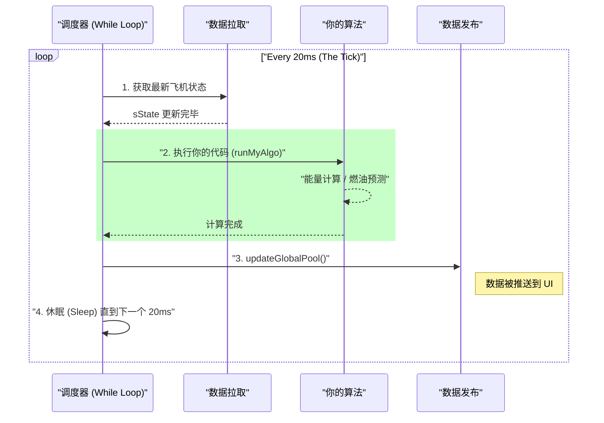

# 工程接入与数据总线规约 (Algorithm Integration & Data Bus Protocol)

> **版本**: 2026.01
> **适用对象**: 算法工程师 / 飞行力学开发者
> **核心目标**: 让算法专注于数学计算，完全屏蔽底层工程细节。

---

## 1. 核心理念：为什么我们需要你的算法？ (Core Philosophy)

在 VoidMei 架构中，我们采用了 **"大脑与躯干分离"** 的设计模式。

*   **框架 (The Body)**: 负责所有的"脏活累活" —— 网络请求、线程调度、内存管理、UI 渲染、窗口拖拽。
*   **算法 (The Brain)**: 负责核心的"智慧" —— 能量计算、弹道解算、燃油预测。

**你的任务非常简单**：框架会定期（每 20ms）喂给你一份最新的飞机状态数据，你只需要根据这些数据算出一个结果，然后把它扔回给框架。剩下的事情（怎么画在屏幕上、怎么通过网络传输），**统统不需要你关心**。

---

## 2. 宏观流程：数据的生命周期 (The Data Lifecycle)

从 WarThunder 游戏客户端发出数据，到最终显示在屏幕上，经历了一个标准化的流水线：


> **架构优势**: 你可以看到，**你的算法处于绝对的核心位置**，但又与外部系统（Game, UI）完全解耦。

---

## 3. 时间维度：无限循环的引擎 (The Time Dimension)

你的代码并不是只运行一次，而是运行在一个 **高精度的无限循环** 中。

*   **频率 (Frequency)**: 50Hz (每秒 50 次)
*   **周期 (Tick)**: 20ms



**工程约束**:
*   你的算法必须在 **2ms - 5ms** 内跑完。
*   如果不小心写了一个死循环（`while(true)`），你会卡死整个主线程，导致 UI 冻结。

---

## 4. 数据输入：像读结构体一样读数据 (Input: Reading the Struct)

框架在每次循环开始前，都已经把 JSON 数据解析成了一个 **Java 对象 (parser.State)**。你可以把它想象成 C 语言中的 `struct`。

**核心变量**: `Service.sState`

### 4.1 常用参数速查表
以下是你最常访问的物理参数：

| 参数名 | 类型 | 单位 | 说明 | 示例值 |
| :--- | :--- | :--- | :--- | :--- |
| `sState.TAS` | `double` | km/h | 真空速 | `450.5` |
| `sState.IAS` | `double` | km/h | 指示空速 | `320.0` |
| `sState.altitude` | `double` | m | 海拔高度 | `1500.2` |
| `sState.Ny` | `double` | G | 法向过载 | `4.5` |
| `sState.pitch` | `double[]` | deg | 桨距 | `[85.0]` |
| `sState.throttle` | `double` | % | 节流阀 | `100.0` |
| `sState.fuel` | `double` | kg | 剩余燃油 | `500.0` |

### 4.2 代码示例
假设你要写一个逻辑：**当速度<200且高度<500时，判断为危险状态**。

```java
// 在 Service.java 中访问
public void checkDanger() {
    // 1. 直接读取结构体字段
    double spd = sState.TAS; 
    double alt = sState.altitude;
    
    // 2. 执行逻辑
    boolean isDanger = (spd < 200.0) && (alt < 500.0);
    
    // 3. 存储结果 (稍后输出)
    this.dangerFlag = isDanger;
}
```

> **注意**: `sState` 是 **只读** 的输入。修改 `sState.TAS = 9999` 并不会让飞机变快，只会破坏后续的计算逻辑。

---

## 5. 数据输出：零耦合总线 (Output: Zero-Coupling Bus)

你计算出了结果（例如 `energyHeight = 3500.0`），如何让它穿过复杂的网络层和线程层，显示在屏幕上？

**答案是：把它放进快递盒里，不用管快递员是谁。**

在我们的架构中，`updateGlobalPool()` 方法就是那个快递集散中心。我们使用一个简单的 **Key-Value Map** 作为快递盒。

### 5.1 数据翻译官：trans2String (The Formatter)
在数据发出前，通常需要从 `double` (人类难读) 转换为 `String` (人类可读)。
*   **原始值**: `3500.12345678`
*   **格式化**: `String.format("%.1f", val)` -> `"3500.1"`
*   **目的**: 确保 UI 显示整洁，且减少传输带宽。

### 5.2 总线投递口：updateGlobalPool (The Gateway)
在这个方法里，你会看到一个名为 `data` 的 Map 对象。
**它是唯一的输出通道。** 任何你想发送给 UI 的数据，只需 `put` 进去即可。

```java
// 你的算法输出代码
private void updateGlobalPool() {
    // ... 框架已有的代码 ...
    
    // [插入点]
    // 你的计算结果 (Double) -> 格式化 (String) -> 放入信封 (Map)
    
    // 发送能量高度
    data.put("algo_energy", String.format("%.1f", this.myEnergyHeight));
    
    // 发送危险告警
    data.put("algo_warn", this.isDanger ? "DANGER" : "SAFE");
    
    // ... 框架会自动将这个 Map 推送到 EventBus ...
}
```

### 5.3 为什么只用 Map? (Why Map?)
你可能会问：*“为什么不直接调用 `overlay.setEnergy(val)`？”*
这是一个高明的架构决策：
1.  **解耦**: 算法不需要引用 Overlay 对象（空指针安全）。
2.  **灵活**: 你可以随意增加新的 Key（例如 "algo_test_1"），无需修改任何接口定义。
3.  **广播**: 一个 Key 可以被 10 个不同的 Overlay 同时读取（例如仪表盘显示指针，HUD 显示数字）。

---

## 6. 实战演练 (Execution: Implementing a Calculator)

**任务**: 开发一个“能量机动计算器”，计算剩余比能量 (SEP)。
公式：$SEP = V \cdot (T - D) / W$ （简化版: SEP ≈ 爬升率 + 加速度转化）

### Step 1: 在 Service 类中定义变量
```java
public class Service {
    // 定义中间变量
    private double mySEP;
    // ...
}
```

### Step 2: 编写计算逻辑
```java
// 在 run 循环或 slowcalculate 中调用
private void calculateSEP() {
    double v = sState.TAS / 3.6; // km/h -> m/s
    double mass = 5000.0;        // 假设质量 5000kg
    double thrust = sState.throttle * 100.0; // 模拟推力
    double drag = v * v * 0.02;  // 模拟阻力
    
    this.mySEP = (v * (thrust - drag)) / (mass * 9.8);
}
```

### Step 3: 发布数据
```java
// 在 updateGlobalPool() 中
private void updateGlobalPool() {
    // ...
    data.put("my_sep_calc", String.format("%.1f", this.mySEP));
    // ...
}
```

### Step 4: 通知 UI 同事
发给他们一句话：
> *"我的 SEP 数据已经发布了，Key 是 `my_sep_calc`。"*

UI 同事只需在其配置文件中写：
```lisp
(item "实时 SEP" :target "my_sep_calc")
```
数据就会立即出现在屏幕上。

---

## 7. 附录：可用变量参考 (Appendix)

`parser.State` 提供了超过 100 个飞行参数，以下是完整列表的子集：

### 基础飞行
*   `TAS`, `IAS` (速度)
*   `altitude`, `radio_altitude` (高度)
*   `AoA` (攻角), `AoS` (侧滑角)
*   `vspeed` (爬升率)

### 动力系统
*   `RPM`, `RPMthrottle` (转速)
*   `manifold_pressure` (进气压)
*   `water_temp`, `oil_temp` (温度)
*   `magneto` (磁电机)

### 机械状态
*   `gear` (起落架 0-100)
*   `flaps` (襟翼 0-100)
*   `airbrake` (减速板 0-100)
*   `weapon_1`, `weapon_2` (武器状态)

---
*Generated for VoidMei Algorithm Team*
