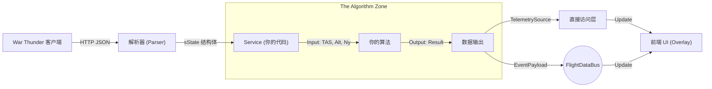
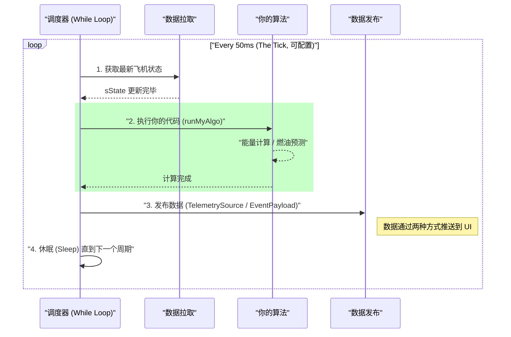

# 工程接入与数据总线规约 (Algorithm Integration & Data Bus Protocol)

> **版本**: 2026.02
> **适用对象**: 算法工程师 / 飞行力学开发者
> **核心目标**: 让算法专注于数学计算，完全屏蔽底层工程细节。

---

## 1. 核心理念：为什么我们需要你的算法？ (Core Philosophy)

在 VoidMei 架构中，我们采用了 **"大脑与躯干分离"** 的设计模式。

*   **框架 (The Body)**: 负责所有的"脏活累活" —— 网络请求、线程调度、内存管理、UI 渲染、窗口拖拽。
*   **算法 (The Brain)**: 负责核心的"智慧" —— 能量计算、弹道解算、燃油预测。

**你的任务非常简单**：框架会定期喂给你一份最新的飞机状态数据，你只需要根据这些数据算出一个结果，然后把它扔回给框架。剩下的事情（怎么画在屏幕上、怎么通过网络传输），**统统不需要你关心**。

---

## 2. 宏观流程：数据的生命周期 (The Data Lifecycle)

从 WarThunder 游戏客户端发出数据，到最终显示在屏幕上，经历了一个标准化的流水线：


```mermaid
graph LR
    Game["War Thunder 客户端"] -->|HTTP JSON| Parser["解析器 (Parser)"]
    Parser -->|"sState 结构体"| Service["Service (你的代码)"]

    subgraph "The Algorithm Zone"
    Service -->|"Input: TAS, Alt, Ny"| Algo["你的算法"]
    Algo -->|"Output: Result"| Output["数据输出"]
    end

    Output -->|TelemetrySource| DirectAccess["直接访问层"]
    Output -->|EventPayload| Bus(("FlightDataBus"))
    DirectAccess -->|Update| UI["前端 UI (Overlay)"]
    Bus -->|Update| UI
```

> **架构优势**: 你可以看到，**你的算法处于绝对的核心位置**，但又与外部系统（Game, UI）完全解耦。

---

## 3. 时间维度：无限循环的引擎 (The Time Dimension)

你的代码并不是只运行一次，而是运行在一个 **高精度的无限循环** 中。

*   **默认频率 (Frequency)**: 20Hz (每秒 20 次)
*   **默认周期 (Tick)**: 50ms (可通过 `serviceLoopIntervalMs` 配置)


```mermaid
sequenceDiagram
    participant Scheduler as "调度器 (While Loop)"
    participant Fetch as "数据拉取"
    participant Algo as "你的算法"
    participant Output as "数据发布"

    loop "Every 50ms (The Tick, 可配置)"
        Scheduler->>Fetch: 1. 获取最新飞机状态
        Fetch-->>Scheduler: sState 更新完毕

        rect rgb(200, 255, 200)
            Scheduler->>Algo: "2. 执行你的代码 (runMyAlgo)"
            Algo-->>Algo: "能量计算 / 燃油预测"
            Algo-->>Scheduler: 计算完成
        end


        Scheduler->>Output: "3. 发布数据 (TelemetrySource / EventPayload)"
        Note right of Output: 数据通过两种方式推送到 UI

        Scheduler->>Scheduler: "4. 休眠 (Sleep) 直到下一个周期"
    end
```

**工程约束**:
*   你的算法应该在 **5-10ms** 内跑完（给 HTTP 轮询和 UI 渲染留出时间）。
*   如果不小心写了一个死循环（`while(true)`），你会卡死整个主线程，导致 UI 冻结。

---

## 4. 数据输入：像读结构体一样读数据 (Input: Reading the Struct)

框架在每次循环开始前，都已经把 JSON 数据解析成了一个 **Java 对象 (parser.State)**。你可以把它想象成 C 语言中的 `struct`。

**核心变量**: `Service.sState`

### 4.1 常用参数速查表
以下是你最常访问的物理参数：

| 参数名 | 类型 | 单位 | 说明 | 示例值 |
| :--- | :--- | :--- | :--- | :--- |
| `sState.TAS` | `double` | km/h | 真空速 | `450.5` |
| `sState.IAS` | `double` | km/h | 指示空速 | `320.0` |
| `sState.altitude` | `double` | m | 海拔高度 | `1500.2` |
| `sState.Ny` | `double` | G | 法向过载 | `4.5` |
| `sState.pitch` | `double[]` | deg | 桨距 | `[85.0]` |
| `sState.throttle` | `double` | % | 节流阀 | `100.0` |
| `sState.fuel` | `double` | kg | 剩余燃油 | `500.0` |

### 4.2 代码示例
假设你要写一个逻辑：**当速度<200且高度<500时，判断为危险状态**。

```java
// 在 Service.java 中访问
public void checkDanger() {
    // 1. 直接读取结构体字段
    double spd = sState.TAS;
    double alt = sState.altitude;

    // 2. 执行逻辑
    boolean isDanger = (spd < 200.0) && (alt < 500.0);

    // 3. 存储结果 (稍后输出)
    this.dangerFlag = isDanger;
}
```

> **注意**: `sState` 是 **只读** 的输入。修改 `sState.TAS = 9999` 并不会让飞机变快，只会破坏后续的计算逻辑。

---

## 5. 数据输出：双模式发布 (Output: Dual-Mode Publishing)

你计算出了结果（例如 `energyHeight = 3500.0`），如何让它穿过复杂的网络层和线程层，显示在屏幕上？

VoidMei 提供了**两种数据输出方式**，根据数据特性选择：

### 5.1 模式 1: TelemetrySource 接口 (高频数值数据推荐)

**适用场景**: 每帧都在变化的数值（速度、高度、能量等）

**优势**: 零 GC 开销，UI 组件直接调用 getter 读取

```java
// 步骤 1: 在 TelemetrySource.java 接口中添加方法声明
public interface TelemetrySource {
    // ... 现有方法 ...
    double getMyEnergyHeight();  // 新增
}

// 步骤 2: 在 Service.java 中实现
public class Service extends Thread implements TelemetrySource {
    private double myEnergyHeight;  // 存储计算结果

    // 在计算循环中更新
    private void calculateMyAlgo() {
        this.myEnergyHeight = computeEnergyHeight();
    }

    // 实现接口方法
    @Override
    public double getMyEnergyHeight() {
        return myEnergyHeight;
    }
}
```

**UI 组件访问方式**:

```java
// 在 Overlay 中
private ui.model.TelemetrySource telemetrySource;

public void init(Service s) {
    // 从 Service 转型获取 TelemetrySource
    if (s instanceof ui.model.TelemetrySource) {
        this.telemetrySource = (ui.model.TelemetrySource) s;
    }
}

@Override
public void onFlightData(FlightDataEvent event) {
    SwingUtilities.invokeLater(() -> {
        double energy = telemetrySource.getMyEnergyHeight();  // 零 GC
        updateDisplay(energy);
    });
}
```

### 5.2 模式 2: EventPayload (低频逻辑标志推荐)

**适用场景**: 布尔标志、状态枚举、不频繁变化的数据

**优势**: 类型安全，编译时检查，不可变对象保证线程安全

```java
// 步骤 1: 在 EventPayload.java 中添加字段
public final class EventPayload {
    // ... 现有字段 ...
    public final boolean myDangerFlag;  // 新增

    // 构造函数和 Builder 也需要对应更新
}

// 步骤 2: 在 Service.updateGlobalPool() 中设置值
EventPayload payload = EventPayload.builder()
    .myDangerFlag(this.isDanger)
    // ... 其他字段 ...
    .build();
```

**UI 组件访问方式**:

```java
@Override
public void onFlightData(FlightDataEvent event) {
    SwingUtilities.invokeLater(() -> {
        EventPayload payload = event.getPayload();
        boolean isDanger = payload.myDangerFlag;  // 类型安全
        if (isDanger) {
            showWarning();
        }
    });
}
```

### 5.3 模式选择决策树

```
┌──────────────────────────────────────────────────┐
│              数据输出模式选择                      │
├──────────────────────────────────────────────────┤
│                                                  │
│  Q: 数据类型是什么？                              │
│      │                                           │
│      ├─ 数值 (double/int) → TelemetrySource      │
│      │   - getMySpeed(), getMyEnergy()           │
│      │   - 零 GC，直接访问                        │
│      │                                           │
│      └─ 布尔/枚举/字符串 → EventPayload          │
│          - payload.myFlag, payload.myState       │
│          - 类型安全，编译时检查                   │
│                                                  │
└──────────────────────────────────────────────────┘
```

### 5.4 为什么不直接调用 UI？

你可能会问：*"为什么不直接调用 `overlay.setEnergy(val)`？"*

这是一个高明的架构决策：

1.  **解耦**: 算法不需要引用 Overlay 对象（空指针安全）。
2.  **类型安全**: EventPayload 的 `boolean` 字段不会因为拼写错误而静默失败，编译器会帮你检查。
3.  **广播**: 一个字段可以被多个不同的 Overlay 同时读取（例如仪表盘显示指针，HUD 显示数字）。
4.  **线程安全**: 数据通过不可变对象或原子读取传递，无需加锁。

---

## 6. 实战演练：双模式示例 (Practical Example)

**任务**: 开发一个"能量机动计算器"，计算剩余比能量 (SEP)，并在超过阈值时显示警告。

### Step 1: 在 Service 类中定义变量
```java
public class Service extends Thread implements TelemetrySource {
    // 数值结果 (通过 TelemetrySource 输出)
    private double mySEP;

    // 布尔标志 (通过 EventPayload 输出)
    private boolean sepWarning;
    // ...
}
```

### Step 2: 编写计算逻辑
```java
// 在 run 循环或 slowcalculate 中调用
private void calculateSEP() {
    double v = sState.TAS / 3.6; // km/h -> m/s
    double mass = 5000.0;        // 假设质量 5000kg
    double thrust = sState.throttle * 100.0; // 模拟推力
    double drag = v * v * 0.02;  // 模拟阻力

    this.mySEP = (v * (thrust - drag)) / (mass * 9.8);
    this.sepWarning = this.mySEP < -10.0;  // SEP < -10 时警告
}
```

### Step 3: 实现 TelemetrySource 接口
```java
// 在 TelemetrySource.java 接口添加
double getMySEP();

// 在 Service.java 实现
@Override
public double getMySEP() {
    return mySEP;
}
```

### Step 4: 更新 EventPayload
```java
// 在 EventPayload.java 添加字段
public final boolean sepWarning;

// 在 Service.updateGlobalPool() 中
EventPayload payload = EventPayload.builder()
    .sepWarning(this.sepWarning)
    // ... 其他字段 ...
    .build();
```

### Step 5: UI 组件消费数据
```java
public class SEPOverlay implements FlightDataListener {
    private TelemetrySource source;

    public void init(Service service) {
        if (service instanceof TelemetrySource) {
            this.source = (TelemetrySource) service;
        }
        FlightDataBus.getInstance().register(this);
    }

    @Override
    public void onFlightData(FlightDataEvent event) {
        SwingUtilities.invokeLater(() -> {
            // 高频数值：TelemetrySource
            double sep = source.getMySEP();

            // 低频标志：EventPayload
            EventPayload payload = event.getPayload();
            boolean warn = payload.sepWarning;

            updateDisplay(sep, warn);
        });
    }
}
```

### Step 6: 通知 UI 同事
发给他们一句话：
> *"我的 SEP 数据通过 TelemetrySource.getMySEP() 和 EventPayload.sepWarning 发布了。"*

---

## 7. HUDData 预计算集成 (HUDCalculator Integration)

对于 MiniHUD 组件，还有第三种输出路径：将计算结果集成到 **HUDData** 中。

### 7.1 为什么需要 HUDData？

MiniHUD 的 `HUDCalculator` 在 Service 线程预计算所有显示数据，避免在 EDT 上执行耗时计算。如果你的算法结果需要在 MiniHUD 中显示，应该集成到这个流程。

### 7.2 集成步骤

```java
// 步骤 1: 在 HUDData.java 中添加字段
public class HUDData {
    // ... 现有字段 ...
    public double mySEP;
    public boolean sepWarning;
}

// 步骤 2: 在 HUDCalculator.calculate() 中设置
public static HUDData calculate(FlightDataEvent event,
                                 TelemetrySource source,
                                 Blkx blkx,
                                 HUDSettings settings,
                                 MinimalHUDContext ctx) {
    HUDData.Builder b = new HUDData.Builder();
    // ... 现有计算 ...

    // 添加你的计算
    b.mySEP = source.getMySEP();
    b.sepWarning = event.getPayload().sepWarning;

    return b.build();
}

// 步骤 3: 在 MiniHUDOverlay 中消费
@Override
public void onFlightData(FlightDataEvent event) {
    HUDData data = event.getHudData();  // 预计算结果
    if (data == null) return;
    SwingUtilities.invokeLater(() -> {
        displaySEP(data.mySEP, data.sepWarning);
    });
}
```

---

## 8. 附录：可用变量参考 (Appendix)

`parser.State` 提供了超过 100 个飞行参数，以下是完整列表的子集：

### 基础飞行
*   `TAS`, `IAS` (速度)
*   `altitude`, `radio_altitude` (高度)
*   `AoA` (攻角), `AoS` (侧滑角)
*   `vspeed` (爬升率)

### 动力系统
*   `RPM`, `RPMthrottle` (转速)
*   `manifold_pressure` (进气压)
*   `water_temp`, `oil_temp` (温度)
*   `magneto` (磁电机)

### 机械状态
*   `gear` (起落架 0-100)
*   `flaps` (襟翼 0-100)
*   `airbrake` (减速板 0-100)
*   `weapon_1`, `weapon_2` (武器状态)

### TelemetrySource 常用方法

| 方法 | 返回类型 | 说明 |
|------|----------|------|
| `getIAS()` | `double` | 指示空速 (km/h) |
| `getTAS()` | `double` | 真空速 (km/h) |
| `getMach()` | `double` | 马赫数 |
| `getAltitude()` | `double` | 海拔高度 (m) |
| `getNy()` | `double` | G 载荷 |
| `getVario()` | `double` | 爬升率 (m/s) |
| `getAoA()` | `double` | 迎角 (deg) |
| `getSEP()` | `double` | 单位剩余功率 (m/s) |
| `getThrottle()` | `double` | 油门位置 (0-110%) |
| `getRPM()` | `double` | 发动机转速 |
| `getManifoldPressure()` | `double` | 进气压 (atm) |
| `getThrust()` | `double` | 推力 (kgf) |
| `getHorsePower()` | `double` | 马力 (hp) |

### EventPayload 字段

| 字段 | 类型 | 说明 |
|------|------|------|
| `isJet` | `boolean` | 是否喷气机 |
| `fatalWarn` | `boolean` | 严重警告 |
| `engineCheckDone` | `boolean` | 发动机检测完成 |
| `radioAltValid` | `boolean` | 无线电高度有效 |
| `isDowningFlap` | `boolean` | 正在放襟翼 |
| `mapGrid` | `String` | 地图格子坐标 |
| `timeStr` | `String` | 燃油时间 |
| `optimalCompressorStage` | `int` | 最优增压器阶段 |
| `compressorStageMismatch` | `boolean` | 增压器阶段不匹配 |

---

## 9. 快速参考卡片 (Quick Reference Card)

```
┌─────────────────────────────────────────────────────────────┐
│                    VoidMei 算法输出快速参考                    │
├─────────────────────────────────────────────────────────────┤
│                                                             │
│  ◆ 高频数值 (double) → TelemetrySource                      │
│    1. TelemetrySource.java 添加 getMyValue()                │
│    2. Service.java 实现 getter                              │
│    3. UI: source.getMyValue() (零 GC)                       │
│                                                             │
│  ◆ 低频标志 (boolean) → EventPayload                        │
│    1. EventPayload.java 添加 public final boolean myFlag    │
│    2. Service.updateGlobalPool() 设置值                     │
│    3. UI: payload.myFlag (类型安全)                         │
│                                                             │
│  ◆ MiniHUD 显示 → HUDData                                   │
│    1. HUDData.java 添加字段                                 │
│    2. HUDCalculator.calculate() 计算                        │
│    3. MiniHUDOverlay: event.getHudData()                    │
│                                                             │
│  ◆ 轮询频率                                                  │
│    默认 50ms (20Hz)，通过 serviceLoopIntervalMs 配置        │
│                                                             │
│  ◆ 黄金法则                                                  │
│    - 数值用 TelemetrySource                                 │
│    - 标志用 EventPayload                                    │
│    - MiniHUD 用 HUDData                                     │
│    - 永远在 EDT 更新 UI                                      │
│                                                             │
└─────────────────────────────────────────────────────────────┘
```

---

*Generated for VoidMei Algorithm Team*
*最后更新: 2026-02*
