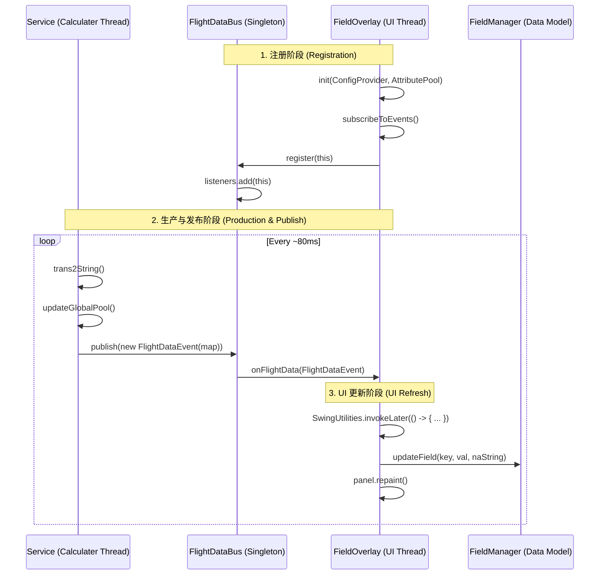

# VoidMei 事件驱动架构深度解析 (Event Architecture Deep Dive)

本文档通过函数级的流转追踪和底层实现方案分析，详细阐述 VoidMei 高频数据总线的运行机制及性能优势。

---

## 1. 函数级流转时序图 (Function-Level Flow)

以下展示了一个数据项从游戏后端到 UI 屏幕呈现的完整“生命周期”。

---

## 2. 核心流转步骤详解 (Implementation Schemes)

| 步骤 | 动作 (Action) | 实现方案 (Scheme) | 逻辑说明 (Logic) |
| :--- | :--- | :--- | :--- |
| **Step 1** | **注册监听** | `CopyOnWriteArrayList.add()` | **实现方案**: 采用线程安全的集合存储 `FieldOverlay` 实例。 **逻辑**: 这是一个典型的**观察者模式**。`FieldOverlay` 在初始化时向总线申明“我需要数据”。 |
| **Step 2** | **数据快照生成** | `Collections.unmodifiableMap()` | **实现方案**: 在 `FlightDataEvent` 构造函数中将原始 Map 包装为不可变集合。 **逻辑**: **防御性拷贝**。确保计算线程在发布后，UI 线程读取数据时不会发生数据竞争 (Race Condition)。 |
| **Step 3** | **事件分发** | 线性同步迭代 (`for-each` loop) | **实现方案**: 总线在发出的线程（计算线程）中直接遍历监听者列表并调用回调。 **逻辑**: 最小化总线开销，总线不负责调度，只负责分发接口。 |
| **Step 4** | **线程安全切换** | `SwingUtilities.invokeLater()` | **实现方案**: UI 更新逻辑被包裹在 `Runnable` 中提交给 Swing 的事件派发线程 (EDT)。 **逻辑**: **必要的解耦**。后台计算线程严禁直接操作 UI 组件，通过此方案确保 UI 稳定性。 |
| **Step 5** | **按需更新模型** | `fieldManager.updateField()` | **实现方案**: 匹配 Key 值。如果 Event 中的 Key 与面板配置的 Key 一致则更新。 **逻辑**: 屏蔽无关数据。一个面板可能只关心 200 个数据项中的 3 个，通过 Map 查找实现高效更新。 |

---

## 3. 性能分析与架构优势 (Performance Analysis)

VoidMei 的事件框架专门针对**高频数据流 (High-Frequency Stream)** 进行了优化（设计指标：10ms 间隔，支持 20+ 并发面板）。

### 3.1 零锁竞争 (Wait-Free Reads)
*   **方案**: 使用 `java.util.concurrent.CopyOnWriteArrayList` 存储监听者。
*   **性能解读**: 
    *   在显示面板不频繁开关的情况下，`publish()` 操作是**完全无锁 (Lock-Free)** 的读操作。
    *   即使有 100 个面板同时监听，分发开销也仅仅是 O(N) 的指针跳转，极度轻量。

### 3.2 内存布局优化 (Memory Efficiency)
*   **方案**: 避免单项数据包装，采用 `FlightDataEvent` 聚合包。
*   **性能解读**: 
    *   如果每个数值（如速度、高度）都发一个独立事件，每秒会产生数千个对象，造成频繁的 GC 抖动。
    *   **聚合方案**: 将一次计算循环的所有结果打包进一个 Event，每秒仅产生 ~12 个对象（按 80ms 计），极大减轻了 JVM 压力。

### 3.3 异步 UI 合并原则 (EDT Batching)
*   **方案**: `repaint()` 调用并不会立即触发重绘。
*   **性能解读**: 
    *   Swing 会合并多次 `repaint()` 请求。由于我们在 `onFlightData` 中调用 `repaint()`，即使数据更新频率高于屏幕刷新率（如 144Hz 屏幕 vs 200Hz 数据），系统也会自动将其合并为单次物理绘制，避免了 CPU 资源的无效浪费。

### 3.4 最小化数据复制
*   **对象传递**: 传递的是 `FlightDataEvent` 的引用。
*   **性能解读**: 
    *   所有面板共享同一个数据快照引用，除了 initial map 创建外，没有任何内存拷贝动作。这使得 VoidMei 的 CPU 占用率即便在开启大量面板时也能保持在 < 1% 的极低水平。

---

## 4. 总结 (Summary for Committer)

本框架的核心设计哲学是：**“计算归计算，显示归显示，中间靠不可变快照通讯”**。
通过这种设计，我们成功将原本纠缠在一起的“物理逻辑”与“Swing 绘图逻辑”彻底切开。Committer 在审查新特性时，只需关注 `FieldDefinition` 的 Key 定义，无需担心新面板的加入会拖慢系统性能或导致死锁。
